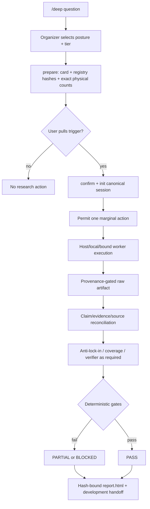

# claude-research-cascade

**English** | [繁體中文](README.zh-TW.md)

[](LICENSE)
[](HARNESS.md)
[](research_harness)

`/deep` is an explicit meta-research trigger for tool-using coding agents. It turns the current host model into the **Organizer** of one bounded research session: the user chooses the epistemic posture, tier, routes, and physical call counts before execution; the runtime then preserves claim lineage, enforces request permits, validates evidence gates, and renders a deterministic HTML handoff.

This is not another model that promises a better long report. Its core guarantee is narrower and testable: unsupported `PASS` states, hidden call expansion, provenance-free artifacts, stale reports, and unsafe evidence deletion fail closed.

## Current Status

The v2 foundation supports:

- hash-bound user-confirmed contracts;
- versioned provider registry and immutable route snapshots;
- canonical JSON state plus hash-chained events;
- exact logical-invocation and physical-request permits;
- immutable, secret-rejecting, provenance-gated raw artifacts;
- crash-safe state/event recovery and authorized purge recovery;
- fail-closed `PASS`, `PARTIAL`, and `BLOCKED` validation;
- deterministic escaped `report.html` bound to the canonical state hash;
- one host-neutral JSON-first Organizer CLI.

**External provider and processor routes are disabled in this foundation slice.** Their API keys may be present and the legacy credential doctor may report them ready, but credential readiness is not v2 execution readiness. A worker route remains disabled until its adapter shares the common v2 request boundary and passes provenance, recovery, policy, and adoption fixtures. Do not bypass the registry by calling the legacy worker CLI from a v2 session.

## Why It Is Different

| Failure mode | V2 response |
|---|---|
| One long report hides weak premises | Atomic load-bearing claims must trace to evidence, source origins, and raw bytes |
| Several models repeat one upstream source | Retrieval/model diversity stays separate from source-origin independence |
| A tier silently expands calls | The user confirms exact stage mappings and physical multiplicity |
| More layers create more hallucinations | Canonical JSON is the only semantic state; HTML is deterministic, not model-authored |
| Missing evidence passes through an empty claim set | `PASS` requires a non-empty bounded answer and evidence floor |
| A provisional answer locks the framing | Medium/High scientific and decision work reserves anti-lock-in and coverage checks |
| High relies on its own reasoning context | High `PASS` requires a context-separated verifier that did not produce the candidate |
| Raw evidence disappears | Purge downgrades state before deletion and leaves a recoverable authorization plus tombstone |
| Keys imply a provider is safe to use | Registry binding, storage rights, fixtures, and adoption evidence are separate hard gates |

## Architecture



Each session contains four non-competing artifacts:

| Path | Purpose |
|---|---|
| `state.json` | The only canonical semantic state |
| `events.jsonl` | Append-only, sequence-numbered, hash-chained operations and revisions |
| `raw/` | Immutable source/local bytes with hash, size, sensitivity, retention, and provenance |
| `report.html` | Deterministic human projection with the canonical state hash |

No second full Markdown report is generated. Agents read JSON without information loss; humans read HTML without introducing another model summarization pass.

## Research Contract

The user chooses both research logic and cost exposure.

### Posture

- `lookup`: a bounded fact defined by a source of record;
- `synthesis`: a landscape, evidence map, or literature review;
- `scientific`: competing mechanisms and discriminating observations;
- `decision`: architecture or action whose premises and inference joints must be audited.

### Tier

- `low`: narrow, reversible, one-cycle research;
- `medium`: development-grade evidence with reserved post-result reinforcement;
- `high`: difficult or hard-to-reverse work with additional challenge and fresh-context verification;
- `custom`: exact user-selected stage and count map.

Tiers do not pretend to control a provider's internal token spend or exact price. The enforceable unit is the physical request count. The card separately discloses host context, local work, estimated spend uncertainty, raw-storage limits, and reserved calls.

## Repository Map

| Path | Purpose |
|---|---|
| [HARNESS.md](HARNESS.md) | Host-neutral v2 Organizer protocol |
| [SKILL.md](SKILL.md) | Claude Code `/deep` binding |
| [AGENTS.md](AGENTS.md) | Codex `/deep` binding |
| [research_harness](research_harness) | Contract, state, storage, quota, artifact, validation, rendering, and operation primitives |
| [scripts/research_state.py](scripts/research_state.py) | Main v2 JSON-first CLI |
| [scripts/validate_state.py](scripts/validate_state.py) | V2 session gate plus retained legacy Markdown validator |
| [scripts/render_report.py](scripts/render_report.py) | Thin deterministic renderer CLI |
| [research_harness/provider_registry.json](research_harness/provider_registry.json) | Versioned provider portfolio and route policy |
| [WORKERS.md](WORKERS.md) | Legacy worker behavior and future adapter reference |
| [examples/v2](examples/v2) | Confirmed no-paid-provider foundation example |
| [docs/superpowers/specs](docs/superpowers/specs) | Design and provider-portfolio rationale |

## Install

### Claude Code

```bash
git clone https://github.com/jechiu16/claude-research-cascade ~/.claude/skills/deep
```

Claude Code discovers [SKILL.md](SKILL.md). Use the project virtual environment or another interpreter with `requirements.txt` installed.

### Codex

Install as a global Codex skill or clone anywhere and expose the checkout path:

```bash
git clone https://github.com/jechiu16/claude-research-cascade ~/tools/claude-research-cascade
export DEEP_HARNESS_DIR=~/tools/claude-research-cascade
```

Codex also reads [AGENTS.md](AGENTS.md) from a project hierarchy. The binding explains project stubs and absolute-path invocation.

## V2 Quick Start

This smoke path makes no paid provider call and performs no external worker request:

```bash
PY=/Users/jechiu/dev/parallax/.venv/bin/python
SESSION="$(mktemp -d)/session"

"$PY" scripts/research_state.py providers --json

"$PY" scripts/research_state.py init "$SESSION" \
  --question "Choose a cache" \
  --contract examples/v2/medium-contract.json \
  --json

"$PY" scripts/research_state.py validate "$SESSION" --json
"$PY" scripts/research_state.py render "$SESSION" --json
```

The committed contract is a deterministic fixture. For a real `/deep`, first run `prepare`, show the card and hashes to the user, wait for a choice, then run `confirm` and `init`.

## Organizer CLI

```text
providers       secret-free registry capability view
prepare         normalize and hash an unconfirmed contract card
confirm         bind the exact displayed card after user choice
init            create canonical state and genesis event
patch           apply a revision-checked Organizer patch
permit          reserve exact physical requests
status          show state, quota use, and validation
artifact-add    ingest local/user/fetched-source bytes securely
artifact-purge  downgrade, purge, validate, and rerender
recover         recover WAL and already-authorized pending purge
validate        run structural, lineage, quota, artifact, and verdict gates
render          atomically write deterministic report.html
view            open the current report
```

Every successful command emits exactly one JSON object on stdout with `--json`. Errors and progress go to stderr.

## Provider Portfolio

The registry is a capability and policy ledger, not a hard-coded provider order. Current design priorities are:

1. direct source-of-record APIs for canonical development facts;
2. Brave as the first independent general-index candidate;
3. OpenAlex, Crossref, and Europe PMC for scholarly coverage;
4. an Exa-versus-Mojeek benchmark by query class;
5. Jina or Firecrawl only after measured fetch failures.

All are disabled until their worker adapters and adoption evidence exist. Generic Google-plus-Brave concurrency is not the default; a second route must justify its extra physical count through expected unique-origin or decision value. No new key is requested before a named adapter fixture and benchmark budget are ready.

## Legacy Workers

`scripts/deep_research.py`, `doctor.py`, legacy Markdown examples, and `WORKERS.md` remain for compatibility and adapter migration. They are not proof of v2 enforcement. In particular:

- a green credential check does not enable a registry route;
- legacy calls do not acquire v2 permits;
- legacy raw payload paths do not satisfy v2 provenance and storage-rights gates;
- no paid legacy call is required by the foundation tests.

## Verification

```bash
PY=/Users/jechiu/dev/parallax/.venv/bin/python

"$PY" -m unittest discover -s tests -v
"$PY" -m py_compile research_harness/*.py scripts/*.py
"$PY" scripts/validate_transcripts.py --json
"$PY" /Users/jechiu/.codex/skills/.system/skill-creator/scripts/quick_validate.py .
```

The deterministic suite covers positive Medium lookup and High decision sessions plus false `PASS`, quota, corruption, secret, provenance, stale-report, purge-recovery, XSS, and CLI boundary cases. Comparative paid evaluation and external provider adoption remain separate, user-budgeted follow-on work.

## License

[MIT](LICENSE)
