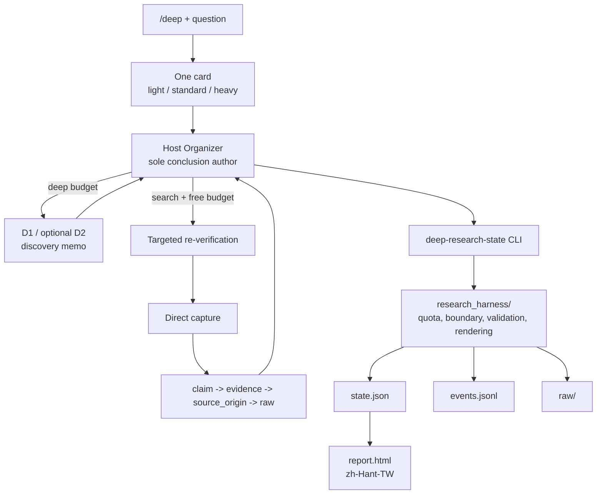

# Agent Deep Research Trigger

[](https://github.com/jechiu16/agent-deep-research-trigger/actions/workflows/ci.yml)
[](LICENSE)

**A Deep Research report is not yet a development decision.** `/deep` lets a
Claude Code or Codex host buy research breadth, re-check the load-bearing facts,
and hand the next coding session a concise evidence-bound result.

[繁體中文](README.zh-TW.md)

## Why This Exists

A direct provider call can be broad and polished while still leaving unclear
cost, weak citation entailment, and a long report the next session must reread.
This skill keeps the host in charge: providers discover; direct evidence
supports claims; the host corrects, annotates, and concludes.

## What You Get

One confirmation card, background execution, and two views of one result:

> recommendation · direct reasons · limitations · next reversible coding action

The next agent reads canonical JSON. A human reads a Traditional Chinese HTML
report. Budget or evidence gaps are visible but never prevent delivery.

## How Quality Is Earned

- The host is the only conclusion author. D1/D2 buy breadth and structure, not truth.
- Provider synthesis is discovery-only; load-bearing claims trace to exact direct captures.
- The host performs targeted re-verification, fixes errors, and marks what cannot be verified.
- Cost is bounded by call counts: `deep`, `search`, and unlimited `free` routes.
- Integrity still fails closed; uncertainty produces an annotated package, not silence.

## Architecture



## Glossary

- **Organizer:** the selected Claude Code or Codex host; it frames, verifies, concludes, and hands off.
- **D1 / D2:** replaceable Deep Research discovery calls. D2 is optional and host-selected after D1.
- **Targeted re-verification:** focused checks chosen after discovery; findings are corrected or annotated.
- **Cost class:** `deep`, `search`, or `free`. Profiles contain counts, never provider names.
- **Direct capture:** immutable source bytes, provenance, and an exact excerpt that may support a claim.
- **Source-origin independence:** genuinely different upstream origins, not models or indexes repeating one source.

## Quickstart

1. **Install the skill and runtime.**

```bash
git clone https://github.com/jechiu16/agent-deep-research-trigger.git \
  "$HOME/.agent-deep-research-trigger"
cd "$HOME/.agent-deep-research-trigger"
python3 -m venv .venv
.venv/bin/python -m pip install -e .
```

2. **Link it to one or both hosts.**

```bash
mkdir -p "$HOME/.claude/skills" "$HOME/.agents/skills"
ln -s "$PWD" "$HOME/.claude/skills/deep"
ln -s "$PWD" "$HOME/.agents/skills/deep"
```

3. **Start a fresh host session.**

4. **Type `/deep` and choose one printed profile.**

```text
/deep Compare SQLite and DuckDB as Parallax's default local analytics engine.
```

## Profiles

The defaults are ordinary JSON and remain user-controlled:

| Profile | Deep calls | Search calls | Free routes |
|---|---:|---:|---|
| Light | 0 | 5 | Unlimited |
| Standard | 1 | 15 | Unlimited |
| Heavy | 2 | 30 | Unlimited |

Providers live in the registry, not this table. Deep providers are ranked by
current configured cost; source fit or privacy may justify another disclosed
candidate. Adding a tool changes only its registry class.

## Demo

The first response is one card, not an automatic research call:

```text
問題：Parallax 應選 SQLite 還是 DuckDB 作為預設本機分析引擎？
Query Brief：選出預設值；限目前架構；成功條件是可逆實作與明確驗收。
建議：light，因為目前 repository 已有可直接複驗的正式 ADR。
Light：deep 0｜search 5｜free unlimited
Standard：deep 1｜search 15｜free unlimited
Heavy：deep 2｜search 30｜free unlimited
D1：最低成本 ready provider；研究問題可外送，本機檔案不外送
共通：背景執行；host 複驗並寫結論；交付 JSON + 繁體中文 HTML；超限即停並標註缺口
開始：light｜standard｜heavy｜調整｜取消
```

## Field Acceptance

Four real Parallax questions passed. The first three exercised the low-cost
Light path. The fourth ran Standard end to end with `deep=1`, `search=1`,
external direct captures, per-claim dispositions, and Traditional Chinese
HTML; it also corrected D1's overly absolute framing of Quack.

- [DuckDB source of truth](examples/field/01-duckdb-source-of-truth/session/report.html)
- [Regime staleness boundary](examples/field/02-regime-staleness-boundary/session/report.html)
- [Long-job acceptance test](examples/field/03-long-job-acceptance-test/session/report.html)
- [DuckDB concurrency boundary](examples/field/04-duckdb-concurrency-boundary/session/report.html)
- [Decision delta and tier calibration](examples/field/04-duckdb-concurrency-boundary/decision-delta.md)
- [Acceptance notes](examples/field/README.md)

## Outputs

| Output | Purpose |
|---|---|
| `state.json` | Machine-readable conclusion, claims, gaps, and coding handoff. |
| `events.jsonl` | Hash-chained request, revision, and budget journal. |
| `raw/` | Immutable, policy-gated evidence bytes. |
| `report.html` | Deterministic Traditional Chinese human report. |

No second full Markdown report is generated.

## Project Links

- [SKILL.md](SKILL.md): concise public protocol
- [HARNESS.md](HARNESS.md): internal runtime bridge
- [CONTRIBUTING.md](CONTRIBUTING.md): development checks
- [SECURITY.md](SECURITY.md): private security reporting

## License

[MIT](LICENSE)
