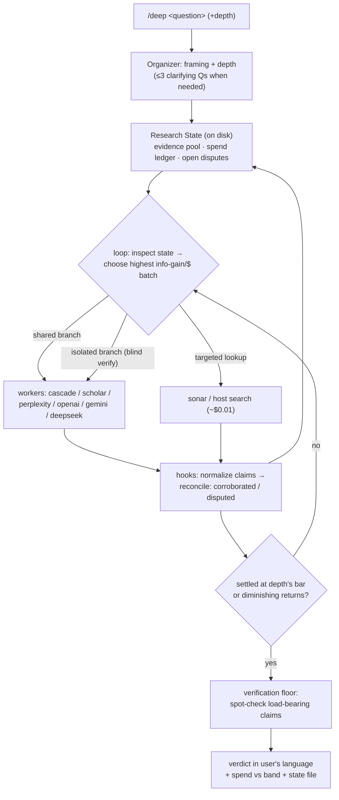

# claude-research-cascade

`/deep` — a **meta-research trigger** for tool-using LLM agents. It doesn't run a fixed pipeline; it wakes the host agent (Claude Code, Codex, …) as the **Organizer** of a single-execution, stateful, bounded research harness over a portfolio of workers — from a $0.01 fact-check to a cross-validated multi-engine investigation.

Not another Deep Research. A harness that treats Deep Research APIs, search APIs, academic APIs, and cheap models as **orchestratable components**, and optimizes information gain per dollar across the whole portfolio.

## Architecture

| Piece | Role |
|---|---|
| [HARNESS.md](HARNESS.md) | **host-neutral spec**: workers manifest（tools characterized by cost／latency／index family／failure modes）, Research State schema, the loop, hooks, depth presets, verification floor |
| [SKILL.md](SKILL.md) | Claude Code binding — registers `/deep`, maps harness primitives to Claude Code tools |
| [AGENTS.md](AGENTS.md) | Codex binding — same harness, Codex-native conventions |
| [scripts/deep_research.py](scripts/deep_research.py) | the workers CLI — deterministic, single-call, resumable; JSON out |



## Why this shape

1. **Depth, not plans** — the user picks a depth（quick／standard／deep／exhaustive）; the Organizer decides each next dollar from the live evidence state. The most expensive failure of deep research — a $4 run aimed at a badly-specified question — is prevented by cheap heterogeneous probing（`cascade`）before any expensive call.
2. **Role separation** — engines do what they're good at: search engines research, Semantic Scholar grounds claims in papers, DeepSeek（no retrieval, hallucination-prone ungrounded）only ever processes already-fetched material.
3. **Claim-level state** — evidence lives in an on-disk pool with provenance and independence tags; conflicts become `disputed` items and **only unresolved disagreements get more spend**. The spend ledger makes every dollar auditable.
4. **A verification floor** — load-bearing claims get an independent spot-check before delivery. Research reports are hypotheses, not facts.
5. **Host-agnostic** — one spec, thin bindings. Anything that can run a shell and read markdown can be the Organizer.

## Workers

| Worker | Engine | Typical cost | Typical time |
|---|---|---|---|
| scout | `cascade` — 4 parallel sonar-pro probes（direct／counter／landscape／falsifier）, merged | ~$0.10–0.15 | ~30 s |
| quick | Perplexity `sonar-pro` | ~$0.01 | seconds |
| scholar | Semantic Scholar Graph API | free | seconds |
| standard | Perplexity `sonar-deep-research`（medium） | $0.5–1 | 2–5 min |
| deep | OpenAI `o3`／`o4-mini-deep-research`, Perplexity high, or Gemini | $0.4–8 | 5–25 min |
| processor | DeepSeek v4 over `--files` | ~free | 1–5 min |

## Install

```bash
# 1. Clone to your agent's skill directory, e.g. for Claude Code:
git clone https://github.com/jechiu16/claude-research-cascade ~/.claude/skills/deep
# 2. Install worker deps into whatever python will run them:
pip install requests python-dotenv          # + google-genai for the gemini provider
# 3. Keys:
cp .env.example .env                        # fill in the keys for the providers you'll use
                                            # (scholar even works keyless, at stricter shared-pool limits)
```

Key resolution order: process env → nearest `.env` from your working directory upward → `.env` beside the scripts. Project-local keys win; the skill-local `.env` makes `/deep` work from any directory.

## Workers CLI

```bash
# pick the python that has the deps: project venv first, else system
PY=.venv/Scripts/python.exe   # Windows; POSIX: PY=.venv/bin/python; no venv: PY=python3

"$PY" scripts/deep_research.py --provider sonar                "quick question"
"$PY" scripts/deep_research.py --provider cascade              "scout: 4 probe framings in one call"
"$PY" scripts/deep_research.py --provider scholar              "dynamic factor model nowcasting"
"$PY" scripts/deep_research.py                                 "standard research question"    # perplexity medium
"$PY" scripts/deep_research.py --provider openai --effort high "decision-critical question"    # o3
"$PY" scripts/deep_research.py --provider deepseek --files a.md --files b.md "merge into a claims table"
"$PY" scripts/deep_research.py --resume "openai:resp_abc123"   # recover a dropped job — don't re-pay
```

Output: one JSON object on stdout（`report`, `report_path`, `usage`, `cost_estimate_usd`, `wall_time_s`）; progress + resume token on stderr; report saved to `<cwd>/reports/deep_<timestamp>_<slug>.md` with usage, official/estimated cost, and a Sources section.

## Field notes（measured, not vibes）

- Perplexity `reasoning_effort=minimal` is **ungrounded**: bills searches, returns zero citations, writes from parametric memory. Use `medium`+ for real research.
- Perplexity returns an official `usage.cost.total_cost` — reported verbatim. OpenAI returns no cost field; the engine estimates from tokens + search-call count.
- Perplexity usage fields can be `key: null` — the engine is None-safe throughout.
- Perplexity deep research: ~5 RPM on low tiers. Semantic Scholar: 1 request/sec with a key（engine retries a 429 once; never call scholar in parallel）; keyless falls back to the shared pool.
- OpenAI deep-research models require a **verified organization**（one-time, platform.openai.com → settings → Verify Organization）.
- Gemini's Interactions API had a breaking change in May 2026; the engine targets the new `steps` schema（needs `google-genai ≥ 2.0`）. Gemini writes sources as markdown links inside the report body.
- DeepSeek thinking models reject `temperature`／`top_p` — the engine never sends them.
- Report filenames embed `hash(query + pid)` — parallel probes and pure-CJK queries can't overwrite each other.
- Failed polls exit with `{"error": …, "resume": "provider:id"}` — an Organizer should resume, never re-pay.

## License

MIT
