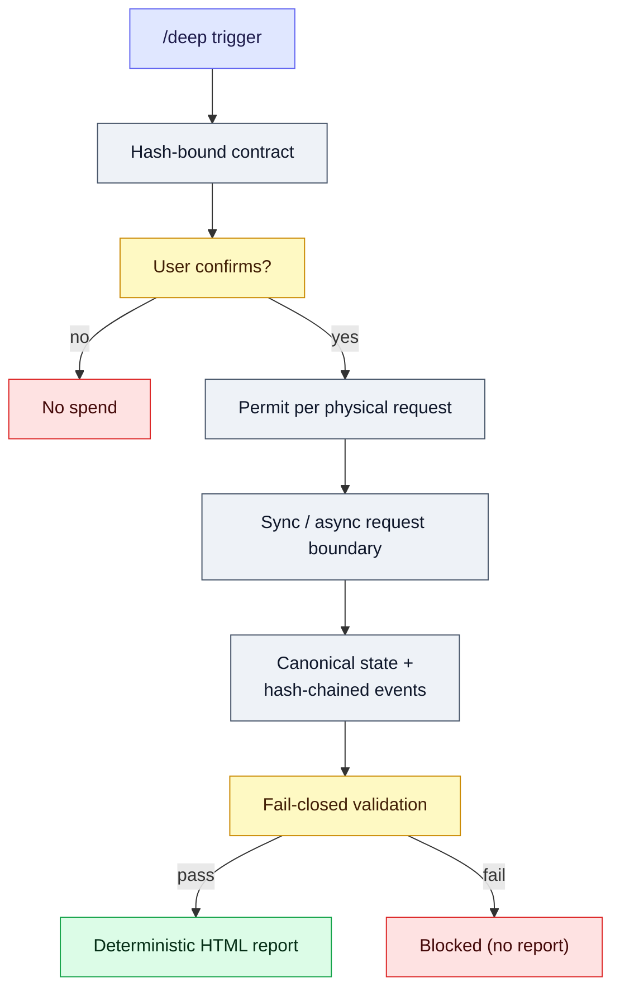

# Agent Deep Research Trigger

[](https://github.com/jechiu16/agent-deep-research-trigger/actions/workflows/ci.yml)
[](https://github.com/jechiu16/agent-deep-research-trigger/releases)
[](pyproject.toml)
[](LICENSE)

**A portable `/deep` research agent skill for Claude Code and OpenAI Codex.**
It turns an explicit trigger into a bounded, cost-aware, evidence-gated research
session with resumable multi-provider execution and a deterministic report.

[繁體中文](README.zh-TW.md) ·
[Release](https://github.com/jechiu16/agent-deep-research-trigger/releases)

## Contents

[Why this exists](#why-this-exists) · [Key terms](#key-terms) · [Host compatibility](#host-compatibility) · [Quickstart](#quickstart) · [Install as a shared skill](#install-as-a-shared-skill) · [Use](#use) ·
[How it works](#how-it-works) · [Provider routes](#provider-routes) · [CLI](#cli) · [Credentials and security](#credentials-and-security) · [Development and release quality](#development-and-release-quality) · [Project map](#project-map)

## Why this exists

Deep-research agents are useful, but ordinary orchestration often leaves the
important constraints in prompt prose: who approved spend, which request was
authorized, whether a retry paid twice, where a claim came from, and whether
a final `PASS` actually cleared its evidence floor.

Agent Deep Research Trigger makes those constraints executable:

- the user confirms an exact research contract before external spend;
- every physical request consumes a route- and stage-specific permit;
- paid asynchronous submissions are never silently resubmitted;
- provider bytes are spooled before parsing;
- state changes are revision-checked and crash-recoverable;
- claims must trace to evidence and source origins;
- a final verdict passes only after fail-closed validation clears the evidence floor;
- HTML output is rendered deterministically from one canonical JSON state.

## Key terms

The rest of this document leans on a few precise terms instead of loose ones like "step" or "call":

| Term | Meaning |
|---|---|
| Organizer | The agent role that proposes, confirms, and executes the research contract |
| Contract | The exact, hash-bound research plan the user approves before any spend |
| Posture | The research mode: `lookup`, `synthesis`, `scientific`, or `decision` |
| Tier | The cost/depth budget: `low`, `medium`, `high`, or a custom request envelope |
| Permit | A one-time authorization for exactly one physical request |
| Physical request | The unit a permit authorizes and quotas count — one boundary execution, whether a provider network call or a deterministic local route |

## Host compatibility

| Host | Discovery | Binding |
|---|---|---|
| [Claude Code](https://code.claude.com/docs/en/skills) | `SKILL.md`, `.claude/skills/deep/SKILL.md` | Native search/fetch and local tools after permits |
| [OpenAI Codex](https://developers.openai.com/codex/build-skills/) | `AGENTS.md`, `.agents/skills/deep/SKILL.md` | Native web and shell/file tools after permits |
| Other Agent Skills hosts | Root `SKILL.md` | Host-neutral protocol in `HARNESS.md` |

The research protocol is shared. Host files only map native tools to the same mechanical runtime; they do not define competing behavior.

## Quickstart

Run the full machine with no network, API key, or cost:

```bash
git clone https://github.com/jechiu16/agent-deep-research-trigger.git
cd agent-deep-research-trigger

python3 -m venv .venv
.venv/bin/python -m pip install -e .
.venv/bin/deep-research-state demo /tmp/agent-deep-demo --json
```

Expected result:

```json
{"validation_ok": true}
```

The demo proves the permit → request boundary → occurrence → validation →
report path. Its no-network route is structurally forbidden from supporting a
real claim.

## Install as a shared skill

Keep one checkout and expose it to either or both hosts:

```bash
git clone https://github.com/jechiu16/agent-deep-research-trigger.git \
  "$HOME/.agent-deep-research-trigger"
cd "$HOME/.agent-deep-research-trigger"

python3 -m venv .venv
.venv/bin/python -m pip install -e .

# Claude Code personal skill
mkdir -p "$HOME/.claude/skills"
ln -s "$PWD" "$HOME/.claude/skills/deep"

# Codex personal skill
mkdir -p "$HOME/.agents/skills"
ln -s "$PWD" "$HOME/.agents/skills/deep"
```

Project-local discovery wrappers are already included under `.claude/skills`
and `.agents/skills`. Codex also reads the root `AGENTS.md` when working in this
repository.

## Use

Invoke the workflow explicitly:

```text
/deep Compare SQLite and DuckDB as the default local analytics engine.
```

The Organizer first shows a contract card containing:

- posture: `lookup`, `synthesis`, `scientific`, or `decision`;
- tier: `low`, `medium`, `high`, or a custom request envelope;
- selected route and physical request ceilings;
- reserved challenge or verification calls;
- storage class, latency, and cost uncertainty.

No research request runs until the user confirms the exact card and its binding hashes. A changed registry, route record, or card requires a new confirmation.

## How it works



Each session owns four artifacts:

| Artifact | Purpose |
|---|---|
| `state.json` | Canonical semantic state |
| `events.jsonl` | Append-only, sequence-numbered hash chain |
| `raw/` | Immutable, provenance-bound provider or local bytes |
| `report.html` | Human view bound to the canonical state hash; declares `zh-Hant-TW`, uses Traditional Chinese interface copy, and preserves source/evidence text in its original language |

See [HARNESS.md](HARNESS.md) for the complete host-neutral protocol.

## Provider routes

The versioned [provider registry](research_harness/provider_registry.json) is a
policy ledger, not a fan-out pipeline. The Organizer selects one primary scout
and escalates only when the confirmed contract permits it.

Enabled route classes include:

| Route class | Providers |
|---|---|
| General discovery and challenge | Brave, Sonar, Exa |
| Source of record | GitHub, PyPI, OSV, NVD, IETF |
| Scholarly discovery | OpenAlex, Crossref, Semantic Scholar, Europe PMC |
| Asynchronous investigation | Perplexity Deep Research, OpenAI Deep Research (o4-mini) |
| Host-native and local inspection | — |
| Deterministic no-network test | — |

Exa is enabled for anti-lock-in and verification after a bounded paired-index
benchmark; Brave is the recommended general scout. Listing results cannot
support claims until the decisive source is fetched directly. Every other
external worker route stays disabled until the registry marks it enabled and
v2-bound; a present credential is never execution readiness by itself.

## CLI

```text
providers         inspect secret-free route capabilities
demo              one-command no-network end-to-end session (permit -> occurrence -> report.html)
prepare           normalize and hash an unconfirmed contract
confirm           bind the exact user-approved contract
init              create canonical state and genesis event
permit            reserve exact physical requests
attempt           journal one attempt-status transition for an acquired action
execute           run one permitted synchronous request
deep-submit       submit one paid async job, never auto-retried
deep-poll         perform one permitted poll
deep-timeout      move an accepted deep action to uncertain past its contract cap (free)
deep-pending      list harvestable async jobs without network access
status            show canonical status and quota use
citations         harvest deduplicated citations for verification-stage sampling (free)
patch             apply a revision-checked Organizer update
artifact-add      securely ingest local or fetched bytes
promote           promote a boundary-spooled provider payload into the artifact index
artifact-purge    purge, revalidate, and rerender
recover           recover WAL and authorized pending operations
validate          run structure, lineage, quota, artifact, and verdict gates
render            atomically create the deterministic HTML report
view              open report.html in the default browser
```

Use `.venv/bin/deep-research-state --help` for the complete interface.
`.venv/bin/deep-research-state providers --json` gives a secret-free local
readiness check.

## Credentials and security

Copy `.env.example` to `.env` and add only the providers you intend to use.
Environment variables override the nearest `.env`. Credentials are excluded
from state, events, request fingerprints, fixtures, and artifact names.

Spend authority belongs to the confirmed physical request count, not to the
presence of a key. Monetary estimates remain uncertain; provider-reported cost
is preserved when available.

For the threat model, storage rights, recovery rules, and limitations, read [HARNESS.md](HARNESS.md) and the [adapter guide](research_harness/adapters/README.md).

## Development and release quality

```bash
.venv/bin/deep-research-release-gate
```

The release gate requires a clean worktree and runs:

- unit tests with an 80% core branch-coverage floor;
- Ruff static checks and golden transcript validation;
- installed-CLI end-to-end demo;
- wheel and source distribution builds plus Twine metadata checks;
- dependency vulnerability audit.

GitHub Actions verifies Python 3.9, 3.12, and 3.13. A version-matching tag publishes a prerelease only after the same gate passes on a clean hosted runner.

## Project map

| Path | Purpose |
|---|---|
| [SKILL.md](SKILL.md) | Canonical Agent Skills workflow |
| [AGENTS.md](AGENTS.md) | Codex repository guidance |
| [HARNESS.md](HARNESS.md) | Host-neutral Organizer protocol |
| [research_harness](research_harness) | Contract, state, storage, quota, validation, and rendering runtime |
| [research_harness/adapters](research_harness/adapters) | Permit-bound provider adapters |
| [scripts/research_state.py](scripts/research_state.py) | Main JSON-first CLI |
| [docs/benchmarks](docs/benchmarks) | Provider adoption evidence |
| [examples](examples) | Demo artifacts, v2 fixtures, and the calibration eval seed question set |

Contributions should start with [CONTRIBUTING.md](CONTRIBUTING.md). Report
security issues through the private process in [SECURITY.md](SECURITY.md).

## License

[MIT](LICENSE)
