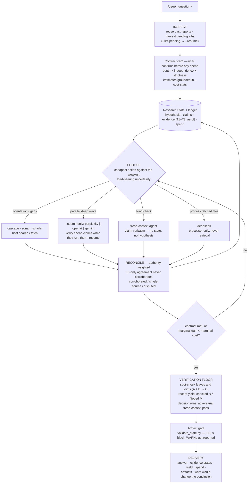

# claude-research-cascade

**English** | [繁體中文](README.zh-TW.md)

[](LICENSE)
[](HARNESS.md)
[](HARNESS.md)

`/deep` is an explicit **meta-research trigger** for tool-using LLM agents.

It activates only when the user explicitly invokes `/deep`. It does not run a fixed "deep research" pipeline. Instead, it turns the host agent, whether Claude Code, Codex, or another tool-using agent, into the **Organizer** of a bounded, stateful research session over a portfolio of workers: cheap lookups, academic search, deep-research APIs, and file-only processors.

The goal is simple: **maximize information gain per dollar** while keeping claims traceable, conflicts visible, and expensive calls reserved for the places where they actually reduce uncertainty.

Primary host: **Claude Code**. Codex is a secondary binding for the same Organizer protocol.

## Why This Exists

Most deep-research workflows are single-engine, one-shot, and hard to audit. This harness treats research as an iterative evidence loop:

| Principle | What it means |
|---|---|
| Contract first | Define depth, independence, and strictness before spending — with estimated cost visible on the card. |
| State on disk | Evidence, spend, disputes, and decisions live in a Research State file plus an append-only ledger. |
| Worker affordances | Choose the cheapest adequate tool first; escalate only when the evidence needs it. |
| Authority-weighted evidence | Sources carry tiers (T1 source of record / T2 secondary / T3 aggregator) and vintage (`as-of`); a pile of T3 agreement never corroborates. |
| Claim-level reconciliation | Track specific claims as corroborated, single-source, disputed, or retired. |
| Verification floor | Spot-check load-bearing claims *and* the inferences joining them; report the yield (checked N / flipped M). |
| Money never evaporates | Async submissions are journaled at submit time; killed sessions harvest back via resume tokens; failed extractions keep the raw payload. |
| Host-neutral core | The runtime spine is in `HARNESS.md`; worker details and scenarios load only when needed. |

## Repository Map

| File | Purpose |
|---|---|
| [HARNESS.md](HARNESS.md) | Short host-neutral Organizer spine: contract, state, loop, verification, delivery, and boundaries. |
| [WORKERS.md](WORKERS.md) | Worker reference: affordance catalog, CLI contract, parallelism, rate limits, privacy, and recovery. |
| [SCENARIOS.md](SCENARIOS.md) | Calibration examples and forward-test prompts for `/deep` behavior. |
| [SKILL.md](SKILL.md) | Claude Code binding. Registers `/deep` and maps harness primitives to Claude Code tools. |
| [AGENTS.md](AGENTS.md) | Codex binding. Explains discovery, install wiring, and Codex-native operating rules. |
| [scripts/deep_research.py](scripts/deep_research.py) | Bundled worker CLI. One call, one action, resumable where supported, JSON on stdout. |
| [scripts/doctor.py](scripts/doctor.py) | Local readiness check for Python, packages, keys, provider availability, writable reports, and unharvested async jobs. |
| [scripts/validate_transcripts.py](scripts/validate_transcripts.py) | Structural validator for golden `/deep` transcripts. |
| [scripts/validate_state.py](scripts/validate_state.py) | Artifact gate for real sessions: contract axes, evidence statuses, spend-vs-ledger reconciliation, pending jobs. |
| [examples/quickstart](examples/quickstart) | Sample state, ledger, and report artifacts from the no-network demo path. |
| [examples/transcripts](examples/transcripts) | Golden transcripts for quick fact, literature review, and decision-critical runs. |
| [requirements.txt](requirements.txt) | Common Python dependencies for network workers and `.env` loading. |
| [.env.example](.env.example) | API key template for worker providers. |

## How It Works



## Research Contract

Every `/deep` session asks the user to confirm three independent axes. The Organizer should infer a recommended preset from context, but it should not spend on workers until the contract is confirmed. Presets are shortcuts, not hard-coded budgets.

| Axis | Options |
|---|---|
| Depth | `shallow`: one probe wave or quick answer / `medium`: probes plus one or two standard reports / `deep`: multiple deep engines, iterated |
| Independence bar | single source OK / load-bearing claims need 2+ sources / 2+ index families plus one blind isolated pass |
| Strictness | first satisfactory answer / close obvious gaps / chase disputes until resolved or provably unresolvable |

Preset names used by the harness:

| Preset | Composition | Typical use |
|---|---|---|
| `fast` | shallow + single source OK + first satisfactory answer | Cheap fact-checks and quick orientation. |
| `standard` | medium + 2-source bar + close obvious gaps | Normal research and cited summaries. |
| `decision` | deep + cross-family blind verification + chase disputes | Decision-critical work. |

Dollar figures in this repository are indicative at list prices. The code records cost where providers expose it, but it does not enforce a budget ceiling.

## Worker Affordances

Workers are tools the Organizer may choose from, not pipeline stages. There is no fixed order: choose the cheapest action that reduces the weakest load-bearing uncertainty. The table below is only a GitHub overview; the execution reference is [WORKERS.md](WORKERS.md).

| Provider | Role | Index family | Typical cost | Typical time |
|---|---|---|---|---|
| `demo` | Local no-network smoke test for JSON/report/ledger contract | None | Free | Instant |
| `cascade` | Four-angle scout: direct answer, counter-evidence, landscape, falsifier | Perplexity | ~$0.10-0.15 | ~30 s |
| `sonar` | Fast grounded lookup for small gaps or spot checks | Perplexity | ~$0.01 | Seconds |
| `scholar` | Semantic Scholar literature search | Semantic Scholar | Free | Seconds |
| `perplexity` | Long cited deep-research report | Perplexity | ~$0.5-1 | 2-5 min |
| `openai` | Long cited deep-research report using OpenAI deep-research models | OpenAI | ~$0.4-8 | 5-25 min |
| `gemini` | Gemini Deep Research report | Google | Varies | 3-10 min |
| `deepseek` | File-only processor for merging, extracting, and comparing existing artifacts | None | ~free | 1-5 min |

Important: `deepseek` is intentionally not a retrieval worker. It should process already-fetched material, not invent new evidence. See [WORKERS.md](WORKERS.md) for stdout JSON, ledger behavior, resume handling, parallelism, and recovery rules.

## Install

### Claude Code

Claude Code is the primary host. Clone the repository into the Claude Code skills directory. `/deep` is then discovered as a skill.

```bash
git clone https://github.com/jechiu16/claude-research-cascade ~/.claude/skills/deep
```

### Codex

Codex is a secondary binding. Clone the repository anywhere, then make it discoverable from your project. Codex reads `AGENTS.md` by walking upward from the session working directory; it does not scan `~/.claude/skills/`.

```bash
git clone https://github.com/jechiu16/claude-research-cascade ~/tools/research-cascade
export DEEP_HARNESS_DIR=~/tools/research-cascade
```

Then add a short `AGENTS.md` stub in your project root:

```md
For `/deep` research, read `<absolute path>/HARNESS.md` and `<absolute path>/AGENTS.md`.
Workers live at `<absolute path>/scripts/deep_research.py`.
```

See [AGENTS.md](AGENTS.md) for the full Codex-specific install notes.

### Any Other Host

Clone the repository anywhere. The host agent needs to read [HARNESS.md](HARNESS.md), then [WORKERS.md](WORKERS.md) only when choosing or invoking workers.

## 30-Second Smoke Test

This verifies the local worker contract without keys, network calls, or spend:

```bash
python scripts/doctor.py
python scripts/deep_research.py --provider demo \
  --ledger reports/deep_state_demo.ledger.jsonl \
  "smoke test"
```

Expected result: `doctor.py` prints provider readiness, the demo worker prints one JSON object on stdout, writes a report under `reports/`, and appends one ledger line. See [examples/quickstart](examples/quickstart) for sample artifacts.

## Golden Transcript Validation

Golden transcripts show the expected `/deep` session shape for quick fact, literature review, and decision-critical research. Validate their structure with:

```bash
python scripts/validate_transcripts.py
```

## Worker Dependencies

Install the common dependencies:

```bash
pip install -r requirements.txt
```

Gemini support also needs:

```bash
pip install google-genai
```

Create a local `.env` from the template:

```bash
cp .env.example .env
```

Key resolution order:

1. Process environment
2. Nearest `.env` found from the current working directory upward
3. `.env` beside the harness checkout

Supported keys:

| Key | Used by |
|---|---|
| `PERPLEXITY_API_KEY` | `sonar`, `cascade`, `perplexity` |
| `OPENAI_API_KEY` | `openai` |
| `GEMINI_API_KEY` | `gemini` |
| `DEEPSEEK_API_KEY` | `deepseek` |
| `S2_API_KEY` | `scholar` (optional; keyless works with stricter shared limits) |

## Worker CLI

Pick the Python interpreter that has the dependencies installed:

```bash
# Windows
PY=.venv/Scripts/python.exe

# POSIX
PY=.venv/bin/python

# No virtualenv
PY=python3
```

Run workers directly:

```bash
python scripts/doctor.py
python scripts/validate_transcripts.py
"$PY" scripts/deep_research.py --provider demo --ledger reports/deep_state_demo.ledger.jsonl "smoke test"
"$PY" scripts/deep_research.py --provider sonar "quick question"
"$PY" scripts/deep_research.py --provider cascade "scout this research question"
"$PY" scripts/deep_research.py --provider scholar "dynamic factor model nowcasting"
"$PY" scripts/deep_research.py "standard research question"
"$PY" scripts/deep_research.py --provider openai --effort high "decision-critical question"
"$PY" scripts/deep_research.py --provider deepseek --files a.md --files b.md "merge into a claims table"
"$PY" scripts/deep_research.py --provider openai --submit-only "fire-and-return; harvest later"
"$PY" scripts/deep_research.py --resume "openai:resp_abc123"
"$PY" scripts/deep_research.py --list-pending
"$PY" scripts/deep_research.py --cost-stats
"$PY" scripts/validate_state.py reports/deep_state_20260709_topic.md
```

Output contract:

| Stream | Contract |
|---|---|
| stdout | One JSON object. Success includes `report`, `report_path`, `usage`, `cost_estimate_usd`, and `wall_time_s`. |
| stderr | Progress only, including async resume tokens. |
| files | Reports are saved under `<cwd>/reports/deep_<timestamp>_<slug>.md`. |

For medium-depth and deeper sessions, pass a ledger path so the worker appends machine-readable spend records:

```bash
"$PY" scripts/deep_research.py \
  --provider cascade \
  --ledger reports/deep_state_topic.ledger.jsonl \
  "research question"
```

## Field Notes

### Durability and recovery

- With `--ledger`, async submissions are journaled at submission time (`event: submitted`), so a killed process never loses a paid resume token; `--list-pending` (and `doctor.py`) list unharvested jobs.
- Failed async polls return JSON with `error` and `resume`; organizers should resume rather than re-pay for submitted work.
- `--submit-only` fires an async engine and returns immediately — submit several engines in one wave, verify cheap claims while they run, then `--resume` each token.
- If extraction of a completed job fails, the raw provider payload is saved to `reports/deep_raw_*.json` first — paid content survives schema drift, and `--resume` re-harvests after a fix at no extra cost.
- `--cost-stats` aggregates per-provider actual costs from your ledgers — ground contract-card estimates in your own price history instead of this README's indicative numbers.
- Report filenames include a short hash of `query + pid` so parallel probes and CJK-only queries do not overwrite one another.

### Provider behavior

- Perplexity `reasoning_effort=minimal` is ungrounded in this workflow: it can bill searches while returning no citations. Use `medium` or higher for real research.
- Perplexity returns official `usage.cost.total_cost`; the worker reports it verbatim. OpenAI does not return a cost field here; the worker estimates from token counts and web-search call count.
- OpenAI deep-research models require a verified organization.
- Semantic Scholar should receive keyword phrases, not natural-language questions, and should not be called in parallel. The worker retries transient GET failures and returns structured paper sources for handoff.
- Gemini uses the Interactions API `steps` schema targeted by the worker and requires `google-genai`.

### Delivery

- Final deliveries are handoff-oriented: contract, evidence status with tiers and vintage, verification yield, spend, artifacts, and next inspection points.

## Status

This is a harness and host binding, not a packaged Python library. The core behavior is specified in Markdown and executed by whichever host agent is acting as Organizer.

## License

[MIT](LICENSE)
