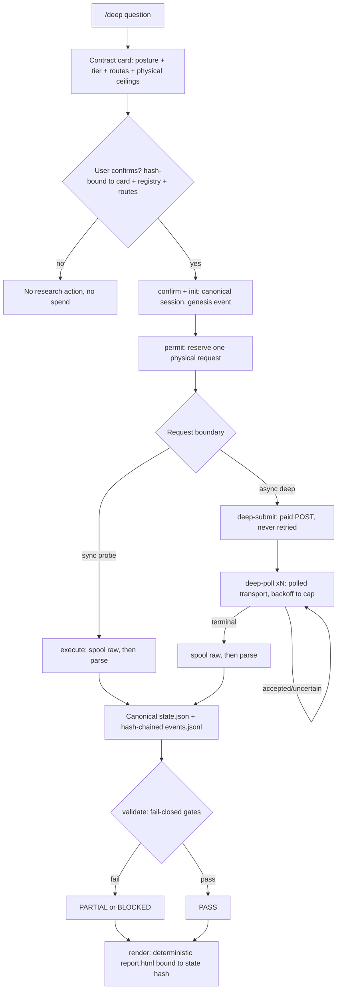

# claude-research-cascade

**English** | [繁體中文](README.zh-TW.md)

[](LICENSE)
[](HARNESS.md)
[](research_harness)

`/deep` is an explicit-trigger research runtime for tool-using coding agents. Typing the literal `/deep` turns the current host model into the **Organizer** of one bounded session — it frames the question, chooses checks, and reconciles evidence — while a separate, mechanical layer enforces the envelope around it: a research contract the user must confirm, hash-bound to the exact card, provider registry, and route records they saw; a permit gating every physical request; an append-only, hash-chained event journal; one canonical JSON state document; fail-closed validation gates; and a deterministic HTML report rendered from that state and nothing else.

## 30-Second Quickstart

Zero network, zero keys, zero cost — exercises the full permit → request-boundary → occurrence → validate → render loop through the no-network `demo-probe` route:

```bash
PY=python3   # any interpreter with requirements.txt installed
"$PY" scripts/research_state.py demo /tmp/deep-demo --json
```

Expect `"validation_ok": true` on stdout, plus a rendered `/tmp/deep-demo/report.html`. The `demo-probe` route can never support a real claim — registry validation hard-fails if it tries — so this proves the machine, not a research finding.

A real session runs the same primitives, one permit-gated step at a time:

```bash
SESSION=/tmp/deep-session

# 1. prepare — normalize and hash an unconfirmed card
"$PY" scripts/research_state.py prepare --contract draft.json --json > prepared.json

# 2. confirm — user pulls the trigger on the exact displayed hashes
"$PY" scripts/research_state.py confirm --prepared prepared.json \
  --card-sha256 "<card>" --registry-sha256 "<registry>" --referenced-records-sha256 "<routes>" \
  --confirmed-at "$(date -u +%Y-%m-%dT%H:%M:%SZ)" --confirmed-by user --json > confirmed.json

# 3. init — canonical session directory + genesis event
"$PY" scripts/research_state.py init "$SESSION" --question "<question>" --contract confirmed.json --json

# 4. permit — reserve one exact physical request
"$PY" scripts/research_state.py permit "$SESSION" --action-id A1 --stage primary_scout \
  --category probe --route sonar --count 1 --fingerprint "user-approved:sonar:A1" --json

# 5. execute — spool the raw payload, then parse it
"$PY" scripts/research_state.py execute "$SESSION" --action-id A1 --query "<query>" --json

# 6. validate, then render — fail-closed gates, deterministic report.html
"$PY" scripts/research_state.py validate "$SESSION" --json
"$PY" scripts/research_state.py render "$SESSION" --json
```

## Architecture



Each session owns four non-competing artifacts:

| Path | Purpose |
|---|---|
| `state.json` | The only canonical semantic state |
| `events.jsonl` | Append-only, sequence-numbered, hash-chained operations and revisions |
| `raw/` | Immutable ingested bytes with hash, size, sensitivity, retention, and provenance |
| `report.html` | Deterministic human projection bound to the canonical state hash |

No second full Markdown report is generated. Agents read canonical JSON for semantic state and follow its spool/artifact references when full provider bytes are needed; humans read HTML without introducing another model summarization pass.

## Invariants

These are guarantees the runtime enforces mechanically, not by convention:

| Invariant | Enforced by |
|---|---|
| The user pulls the spend trigger | `confirm` requires the exact card, registry, and route-record hashes the user was shown; any drift creates a new session instead of reinterpreting the old one |
| One permit is one physical request | `permit` reserves the exact count; a failed or uncertain attempt still consumes it — nothing here refunds |
| Paid submissions are never auto-retried | `deep-submit` is a single paid POST; a timeout or crash moves the job to `uncertain`, never a silent resubmission |
| Raw payloads are spooled before parsing | `execute`, `deep-submit`, and `deep-poll` write the provider byte stream to `provider_spool/` before any parse runs |
| Occurrences are written by code, never by model prose | The request boundary constructs every `retrieval_occurrence` itself; the Organizer cannot author one |
| Demo routes can never support claims | Registry validation hard-fails if a `no_network_demo` route claims `can_support_claims: true` |
| Credentials never enter state, fixtures, or fingerprints | Keys resolve from `env`/`.env` only; fingerprints hash the query, not the credential; ingested bytes are checked against a deterministic secret-pattern floor |
| `PASS` is non-vacuous | Requires a non-empty bounded answer, the contract's evidence floor, full claim→evidence→source-origin lineage, and — at High — a context-separated verifier that did not produce the candidate |

## Route Status

[`research_harness/provider_registry.json`](research_harness/provider_registry.json) is a capability and policy ledger, not a pipeline. A key in `.env` makes a route *eligible*; it does not make it *enabled*. Registry validation hard-fails any `enabled: true` route that lacks a real adapter binding, an active lifecycle, and non-empty adoption evidence. The enabled external routes are `sonar`, `github`, `pypi`, `scholar`, `openalex`, `crossref`, `nvd`, `europe-pmc`, `ietf`, `osv`, `brave`, and the async `perplexity` deep-engine route. `exa` has a bound adapter, fixture suite, and live evidence but remains disabled pending its paired independent-index benchmark. Other disabled candidates are metadata only or unfinished work.

Generated by loading the registry through `research_harness.providers.load_provider_registry()` — the same loader the runtime uses — and printing `id`, `roles`, `index_family`, `enabled`, and `execution_binding` for every record:

| id | roles | index family | enabled | binding |
|---|---|---|---|---|
| `brave` | scout, challenge | brave | yes | `v2_request_boundary` |
| `crossref` | scholarly-scout | crossref | yes | `v2_request_boundary` |
| `demo-cascade` | contract-test | demo | yes | `no_network_demo` |
| `demo-probe` | contract-test | demo | yes | `no_network_demo` |
| `europe-pmc` | biomedical-scout | europe-pmc | yes | `v2_request_boundary` |
| `github` | source-of-record | github | yes | `v2_request_boundary` |
| `host` | organizer, auditor | not_applicable | yes | `host_native_observed` |
| `host-web` | scout, verifier, fetch | host-opaque | yes | `host_native_observed` |
| `ietf` | source-of-record | ietf | yes | `v2_request_boundary` |
| `local` | scout, verifier, experiment | local-project | yes | `local` |
| `nvd` | source-of-record | nvd | yes | `v2_request_boundary` |
| `openalex` | scholarly-scout | openalex | yes | `v2_request_boundary` |
| `osv` | source-of-record | osv | yes | `v2_request_boundary` |
| `perplexity` | investigation | perplexity-aggregated | yes | `v2_request_boundary` |
| `pypi` | source-of-record | pypi | yes | `v2_request_boundary` |
| `scholar` | scholarly-scout | semantic-scholar | yes | `v2_request_boundary` |
| `sonar` | scout, challenge | perplexity-aggregated | yes | `v2_request_boundary` |
| `cascade` | composite-scout | perplexity-aggregated | no | `legacy_unbound` |
| `deepseek` | processor, blind-auditor | not_applicable | no | `legacy_unbound` |
| `exa` | semantic-scout | exa | no | `v2_request_boundary` |
| `firecrawl` | fetch | not_applicable | no | `legacy_unbound` |
| `gemini` | investigation | google | no | `legacy_unbound` |
| `jina` | fetch | not_applicable | no | `legacy_unbound` |
| `mojeek` | scout, challenge | mojeek | no | `legacy_unbound` |
| `openai` | investigation | openai-model-mediated | no | `legacy_unbound` |
| `test-only-unbound-candidate` | candidate | unknown | no | `legacy_unbound` |

*17 of 26 registered routes are enabled, as of commit `c808c4b`.*

The adoption order for the rest — the Exa-vs-independent-index benchmark, then Jina/Firecrawl only after measured fetch failures — is recorded in [`docs/superpowers/specs/2026-07-10-provider-portfolio-design.md`](docs/superpowers/specs/2026-07-10-provider-portfolio-design.md).

## Credentials and Spend

Provider keys resolve from the process environment, then the nearest `.env` — copy [`.env.example`](.env.example) to `.env` and fill in only what you have. A present key makes a route *eligible*; only the registry gate above makes it *enabled*.

Spend authority sits with the user, not the key. `confirm` is the only command that can turn a contract into a session, and it only succeeds when the three supplied hashes match what `prepare` displayed byte-for-byte; changing the card, the registry, or a referenced route record forces a new session instead of silently reinterpreting the old one.

Cost is disclosed as a range, never as an enforceable cap. A contract's `estimated_spend_usd` is explicitly uncertain, because one logical call can carry variable provider-side work; the enforceable unit is the physical request count, not a dollar ceiling. Once a request completes, `sonar`, `perplexity`, `openalex`, and `exa` preserve the provider-reported cost field; free routes such as `github`, `pypi`, and `scholar` report `null` rather than a guessed figure.

Credentials never enter canonical state, events, spool filenames, fixtures, or request fingerprints. Adapters fingerprint the query, not the key, and any ingested artifact whose bytes match a deterministic secret pattern — an API key assignment, a PEM private key, a known provider key prefix — is rejected before it reaches disk.

## Research Contract

The user chooses both research logic and cost exposure.

### Posture

- `lookup`: a bounded fact defined by a source of record
- `synthesis`: a landscape, evidence map, or literature review
- `scientific`: competing mechanisms and discriminating observations
- `decision`: architecture or action whose premises and inference joints must be audited

### Tier

- `low`: narrow, reversible, one-cycle research
- `medium`: development-grade evidence with reserved post-result reinforcement
- `high`: difficult or hard-to-reverse work with additional challenge and fresh-context verification
- `custom`: exact user-selected stage and count map

Tiers do not control a provider's internal token spend or exact price. The enforceable unit is the physical request count; the card separately discloses host context, local work, estimated spend uncertainty, raw-storage limits, and reserved calls.

## Field Notes: v2

**Durability.** Every state write is crash-consistent: a pending transaction file records the previous and next state hash before the swap, so `recover` rolls a killed write forward or back deterministically instead of guessing, and refuses to touch anything but its own owned, malformed tail. `events.jsonl` is append-only and hash-chained. Provider bytes are spooled before parsing. An interrupted async deep-research job is never resubmitted: its job token is journaled at acceptance time, and each later `deep-poll` performs exactly one permitted poll. The Organizer, not the CLI, applies the documented 15s → 30s → 60s → 120s capped cadence.

**The demo doubles as a test.** `research_state.py demo` is not a canned transcript — `tests/test_demo_flow.py` calls the same `main(["demo", ...])` entry point and asserts on its JSON output, its spool file, and its occurrence fields. Running it by hand and running it in CI exercise the identical code path.

**Building an adapter?** Start at [`research_harness/adapters/README.md`](research_harness/adapters/README.md). It states the two-function adapter contract, the fixture requirements (a recorded real response plus at least two recorded failures), and the constraints prior adapter work already ran into.

**Known limits.** Per-operation cost scales with cumulative event-journal length: every operation does a full re-read of `events.jsonl` plus a hash-chain verification of every event, and there is no compaction. Measured against the real `_read_events_unlocked`/`_event_chain_errors` path: roughly 0.005ms marginal cost per journaled event, so a session needs on the order of 200K events before a single operation approaches 1s. Split long-running sessions rather than letting one journal grow unbounded.

## Repository Map

| Path | Purpose |
|---|---|
| [HARNESS.md](HARNESS.md) | Host-neutral v2 Organizer protocol |
| [SKILL.md](SKILL.md) | Claude Code `/deep` binding |
| [AGENTS.md](AGENTS.md) | Codex `/deep` binding |
| [research_harness](research_harness) | Contract, state, storage, quota, artifact, boundary, validation, and rendering primitives |
| [research_harness/adapters](research_harness/adapters) | One module per provider; [README.md](research_harness/adapters/README.md) is the development guide |
| [scripts/research_state.py](scripts/research_state.py) | Main v2 JSON-first CLI |
| [scripts/validate_state.py](scripts/validate_state.py) | V2 session gate plus retained legacy Markdown validator |
| [scripts/render_report.py](scripts/render_report.py) | Thin deterministic renderer CLI |
| [research_harness/provider_registry.json](research_harness/provider_registry.json) | Versioned provider portfolio and route policy |
| [WORKERS.md](WORKERS.md) | Legacy worker behavior and future adapter reference |
| [examples/v2](examples/v2) | Confirmed no-paid-provider foundation example |
| [docs/superpowers/specs](docs/superpowers/specs) | Design and provider-portfolio rationale |

## Install

### Claude Code

```bash
git clone https://github.com/jechiu16/claude-research-cascade ~/.claude/skills/deep
```

Claude Code discovers [SKILL.md](SKILL.md). Use the project virtual environment or another interpreter with `requirements.txt` installed.

### Codex

Install as a global Codex skill or clone anywhere and expose the checkout path:

```bash
git clone https://github.com/jechiu16/claude-research-cascade ~/tools/claude-research-cascade
export DEEP_HARNESS_DIR=~/tools/claude-research-cascade
```

Codex also reads [AGENTS.md](AGENTS.md) from a project hierarchy. The binding explains project stubs and absolute-path invocation.

## Organizer CLI

```text
providers       secret-free registry capability view
prepare         normalize and hash an unconfirmed contract card
confirm         bind the exact displayed card after user choice
init            create canonical state and genesis event
patch           apply a revision-checked Organizer patch
permit          reserve exact physical requests
demo            one-command no-network end-to-end session (permit -> occurrence -> report.html)
execute         run one permitted probe through the v2 request boundary
deep-submit     submit an async deep-research job (paid POST, never retried)
deep-poll       one physical poll of an accepted/uncertain deep job
deep-timeout    free wall-clock check: move a stalled deep action to uncertain
deep-pending    free: list accepted/uncertain deep actions and their job tokens
status          show state, quota use, and validation
artifact-add    ingest local/user/fetched-source bytes securely
artifact-purge  downgrade, purge, validate, and rerender
recover         recover WAL and already-authorized pending purge
validate        run structural, lineage, quota, artifact, and verdict gates
render          atomically write deterministic report.html
view            open the current report
```

Every successful command emits exactly one JSON object on stdout with `--json`. Errors and progress go to stderr.

## Legacy v1 Workers

`scripts/deep_research.py`, `doctor.py`, the legacy Markdown examples, and [WORKERS.md](WORKERS.md) remain for compatibility and adapter migration. They are not evidence of v2 enforcement:

- a green credential check does not enable a registry route;
- legacy calls do not acquire v2 permits;
- legacy raw-payload paths do not satisfy v2 provenance and storage-rights gates;
- no paid legacy call is required by the foundation test suite.

## Verification

```bash
PY=python3   # any interpreter with requirements.txt installed

"$PY" -m unittest discover -s tests -v
"$PY" -m py_compile research_harness/*.py scripts/*.py
"$PY" scripts/validate_transcripts.py --json
```

The deterministic suite covers positive Medium lookup and High decision sessions plus false `PASS`, quota, corruption, secret, provenance, stale-report, purge-recovery, XSS, and CLI boundary cases. Comparative paid evaluation and external provider adoption remain separate, user-budgeted follow-on work.

## License

[MIT](LICENSE)
