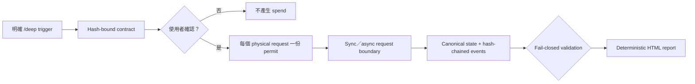

# Agent Deep Research Trigger

[](https://github.com/jechiu16/agent-deep-research-trigger/actions/workflows/ci.yml)
[](https://github.com/jechiu16/agent-deep-research-trigger/releases)
[](pyproject.toml)
[](LICENSE)

**給 Claude Code 與 OpenAI Codex 共用的 `/deep` 研究代理 skill。**
它把明確觸發轉成有邊界、成本可控、證據有 gate、可恢復的多 provider
研究 session，最後從唯一 canonical state 產生 deterministic report。

[English](README.md) · [快速開始](#快速開始) · [運作方式](#運作方式) ·
[Provider routes](#provider-routes) ·
[Releases](https://github.com/jechiu16/agent-deep-research-trigger/releases)

## 為什麼需要它

一般 research orchestration 常把重要限制留在 prompt prose：誰批准費用、哪一個
request 被授權、retry 是否重複付費、claim 從哪裡來，以及最後的 `PASS` 是否真的
通過 evidence floor。

Agent Deep Research Trigger 把這些限制做成可執行規則：

- 使用者先確認精確 research contract，外部 spend 才能開始；
- 每個 physical request 都消耗指定 stage／route 的 permit；
- 付費 async submission 絕不靜默重送；
- provider bytes 一律先 spool 再 parse；
- state update 有 revision check 並可在 crash 後恢復；
- claim 必須連回 evidence 與 source origin；
- HTML 只從唯一 canonical JSON state deterministic render。

## Host 相容性

| Host | Discovery | Binding |
|---|---|---|
| [Claude Code](https://code.claude.com/docs/en/skills) | `SKILL.md`、`.claude/skills/deep/SKILL.md` | Permit 後使用 native search/fetch 與 local tools |
| [OpenAI Codex](https://developers.openai.com/codex/build-skills/) | `AGENTS.md`、`.agents/skills/deep/SKILL.md` | Permit 後使用 native web 與 shell/file tools |
| 其他 Agent Skills host | Root `SKILL.md` | `HARNESS.md` 的 host-neutral protocol |

研究 protocol 只有一份。Host files 只負責 native tool mapping，不定義另一套流程。

## 快速開始

用零 network、零 API key、零成本跑完整 runtime：

```bash
git clone https://github.com/jechiu16/agent-deep-research-trigger.git
cd agent-deep-research-trigger

python3 -m venv .venv
.venv/bin/python -m pip install -e .
.venv/bin/deep-research-state demo /tmp/agent-deep-demo --json
```

預期結果：

```json
{"validation_ok": true}
```

Demo 會走完 permit → request boundary → occurrence → validation → report；它的
no-network route 在結構上不能支持真實 claim。

## 安裝成 Claude Code／Codex 共用 skill

保留一份 checkout，再提供給任一或兩個 host：

```bash
git clone https://github.com/jechiu16/agent-deep-research-trigger.git \
  "$HOME/.agent-deep-research-trigger"
cd "$HOME/.agent-deep-research-trigger"

python3 -m venv .venv
.venv/bin/python -m pip install -e .

# Claude Code personal skill
mkdir -p "$HOME/.claude/skills"
ln -s "$PWD" "$HOME/.claude/skills/deep"

# Codex personal skill
mkdir -p "$HOME/.agents/skills"
ln -s "$PWD" "$HOME/.agents/skills/deep"
```

Gemini worker compatibility 需要 optional SDK：

```bash
.venv/bin/python -m pip install -e ".[gemini]"
```

Repo 已包含 `.claude/skills` 與 `.agents/skills` 的 project-local discovery
wrapper；Codex 在這個 repo 工作時也會讀 root `AGENTS.md`。

## 使用方式

明確輸入 trigger：

```text
/deep 比較 SQLite 與 DuckDB，哪個更適合當本機分析引擎預設值？
```

Organizer 會先顯示 contract card：

- posture：`lookup`、`synthesis`、`scientific` 或 `decision`；
- tier：`low`、`medium`、`high` 或 custom request envelope；
- route 與 physical request ceiling；
- challenge／verification reserve；
- storage class、latency 與 cost uncertainty。

使用者確認精確 card 與 binding hashes 前，不會執行 research request。Registry、
route record 或 card 有任何變動，都必須重新確認。

## 運作方式



每個 session 只有四類 artifact：

| Artifact | 用途 |
|---|---|
| `state.json` | Canonical semantic state |
| `events.jsonl` | Append-only、sequence-numbered hash chain |
| `raw/` | Immutable、provenance-bound provider／local bytes |
| `report.html` | 與 canonical state hash 綁定的人類報告 |

完整 host-neutral protocol 見 [HARNESS.md](HARNESS.md)。

## Provider routes

[Provider registry](research_harness/provider_registry.json) 是 versioned policy
ledger，不是固定 fan-out pipeline。Organizer 只選一個 primary scout，並在 confirmed
contract 允許時才 escalation。

Enabled route 類型包括：

- general discovery／challenge：Brave、Sonar、Exa；
- source of record：GitHub、PyPI、OSV、NVD、IETF；
- scholarly discovery：OpenAlex、Crossref、Semantic Scholar、Europe PMC；
- async investigation：Perplexity Deep Research；
- host-native 與 local inspection；
- deterministic no-network test routes。

Exa 經 bounded paired-index benchmark 後，作為 anti-lock-in／verification route
啟用；Brave 仍是預設 general scout。Result listing 必須直接 fetch decisive source
後才能支持 claim。其他 external worker route 維持 disabled；只有 credential、不代表
worker 已具 execution readiness。

## CLI

```text
providers       查看不含 secret 的 route capability
prepare         normalize 並 hash 未確認 contract
confirm         綁定使用者確認的精確 contract
init            建立 canonical state 與 genesis event
permit          預留精確 physical requests
execute         執行一個已 permit 的 sync request
deep-submit     提交一次付費 async job，永不自動重送
deep-poll       執行一次已 permit poll
deep-pending    不打網路列出可收割 async jobs
patch           套用 revision-checked Organizer update
recover         恢復 WAL 與已授權 pending operation
validate        執行 structure、lineage、quota、artifact、verdict gates
render          atomic 產生 deterministic HTML report
```

完整介面用 `.venv/bin/deep-research-state --help`；本機 secret-free readiness 用
`.venv/bin/deep-research-doctor`。

## Credential 與安全

複製 `.env.example` 成 `.env`，只填實際要使用的 provider。Process environment
優先於最近的 `.env`。Credential 不會進入 state、event、request fingerprint、
fixture 或 artifact filename。

Spend authority 來自 confirmed physical request count，不是 key 是否存在。金額只能
估算；provider 有回報 cost 時才保存實際數值。

Threat model、storage rights、recovery rule 與限制見 [HARNESS.md](HARNESS.md) 和
[adapter guide](research_harness/adapters/README.md)。

## 開發與 release 品質

```bash
.venv/bin/deep-research-release-gate
```

Release gate 要求乾淨 worktree，並執行：

- unit tests 與 80% core branch-coverage floor；
- Ruff static checks 與 golden transcript validation；
- installed CLI end-to-end demo；
- wheel／source build 與 Twine metadata check；
- dependency vulnerability audit。

GitHub Actions 驗證 Python 3.9、3.12、3.13。只有 version-matching tag 在乾淨
hosted runner 通過相同 gate 後，才會發布 prerelease。

## 專案地圖

| Path | 用途 |
|---|---|
| [SKILL.md](SKILL.md) | Canonical Agent Skills workflow |
| [AGENTS.md](AGENTS.md) | Codex repository guidance |
| [HARNESS.md](HARNESS.md) | Host-neutral Organizer protocol |
| [research_harness](research_harness) | Contract、state、storage、quota、validation、rendering runtime |
| [research_harness/adapters](research_harness/adapters) | Permit-bound provider adapters |
| [scripts/research_state.py](scripts/research_state.py) | Main JSON-first CLI |
| [docs/benchmarks](docs/benchmarks) | Provider adoption evidence |
| [examples](examples) | Demo artifacts 與保留的 legacy behavior fixtures |

參與開發請先讀 [CONTRIBUTING.md](CONTRIBUTING.md)；安全問題請依
[SECURITY.md](SECURITY.md) 使用 private reporting。

## License

[MIT](LICENSE)
