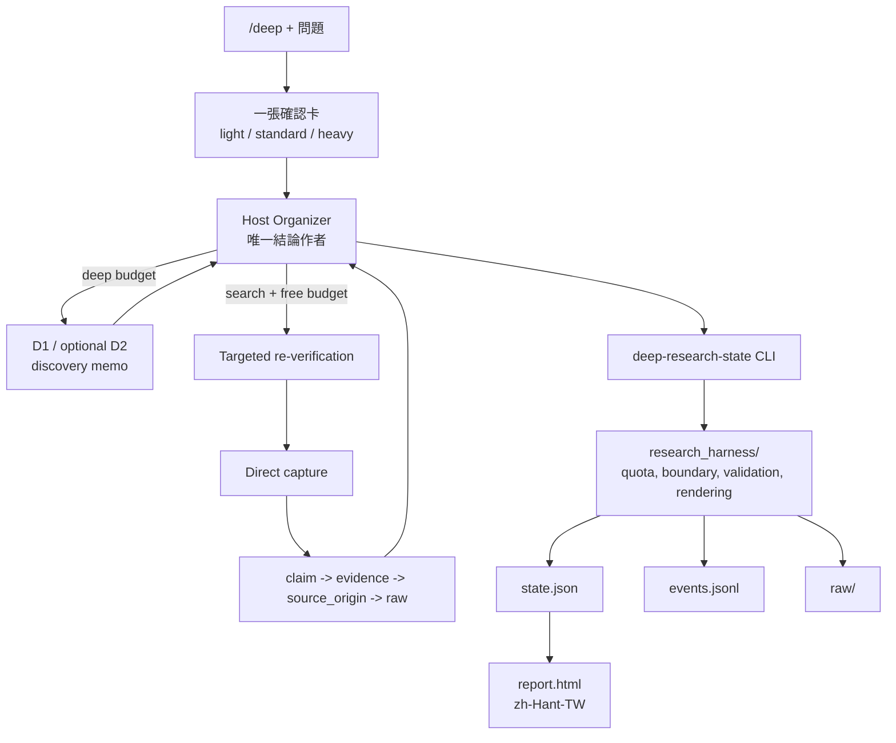

# Agent Deep Research Trigger

[](https://github.com/jechiu16/agent-deep-research-trigger/actions/workflows/ci.yml)
[](LICENSE)

**Deep Research 報告還不是開發決策。** `/deep` 讓 Claude Code 或 Codex host
購買研究廣度、複驗真正承重的事實，再把簡潔且有證據邊界的結果交給下一個
coding session。

[English](README.md)

## 為什麼需要它

直接呼叫 provider 可能很廣、很完整，卻仍留下三個問題：成本不清、citation
未必支持關鍵 claim、下一個 session 必須重讀整份長報告。這個 skill 讓 host
保持主導：provider 負責 discovery，direct evidence 支持 claims，host 修正、標註並下結論。

## 產出長什麼樣

一張確認卡、背景執行，以及同一結果的兩種視圖：

> 建議 · 直接理由 · 限制 · 下一個可逆 coding action

下一個 agent 讀 canonical JSON；人讀繁體中文 HTML。預算或證據缺口會被明確
標註，但不會阻止交付。

## 品質怎麼來

- Host 是唯一結論作者；D1/D2 買廣度與結構，不買真理。
- Provider synthesis 僅供 discovery；load-bearing claims 必須追到 direct capture 的 exact excerpt。
- Host 自主做 targeted re-verification，錯的改，驗不到的標註。
- 成本只用呼叫次數控制：`deep`、`search` 與不限次數的 `free`。
- Integrity 仍 fail closed；不確定性產生有標註的 package，而不是不交付。

## Architecture



## Glossary

- **Organizer：** 當下選用的 Claude Code 或 Codex host；負責 framing、複驗、結論與 handoff。
- **D1 / D2：** 可替換的 Deep Research discovery calls；D2 由 host 看完 D1 後自行決定。
- **Targeted re-verification：** discovery 後由 host 選擇的精準查核；結果必須修正或標註。
- **Cost class：** `deep`、`search` 或 `free`；profile 只放次數，不放 provider 名稱。
- **Direct capture：** 不可變 source bytes、provenance 與可支持 claim 的 exact excerpt。
- **Source-origin independence：** 真正不同的上游 origin，不是 model 或 index 重複同一來源。

## 快速開始

1. **安裝 skill 與 runtime。**

```bash
git clone https://github.com/jechiu16/agent-deep-research-trigger.git \
  "$HOME/.agent-deep-research-trigger"
cd "$HOME/.agent-deep-research-trigger"
python3 -m venv .venv
.venv/bin/python -m pip install -e .
```

2. **連結到一個或兩個 host。**

```bash
mkdir -p "$HOME/.claude/skills" "$HOME/.agents/skills"
ln -s "$PWD" "$HOME/.claude/skills/deep"
ln -s "$PWD" "$HOME/.agents/skills/deep"
```

3. **開啟新的 host session。**

4. **輸入 `/deep`，再選擇卡片上的 profile。**

```text
/deep 比較 SQLite 與 DuckDB，哪個適合當 Parallax 預設本機分析引擎？
```

## Profiles

預設值是普通 JSON，數字由使用者控制：

| Profile | Deep 次數 | Search 次數 | Free routes |
|---|---:|---:|---|
| Light | 0 | 5 | 不限 |
| Standard | 1 | 15 | 不限 |
| Heavy | 2 | 30 | 不限 |

Provider 放在 registry，不放在這張表。Deep provider 依目前設定成本排序；若
source fit 或 privacy 更重要，host 可以改選卡片已揭露的候選。新增工具只改 registry class。

## Demo

第一次回覆只是一張卡，不會自動開始研究：

```text
問題：Parallax 應選 SQLite 還是 DuckDB 作為預設本機分析引擎？
Query Brief：選出預設值；限目前架構；成功條件是可逆實作與明確驗收。
建議：light，因為目前 repository 已有可直接複驗的正式 ADR。
Light：deep 0｜search 5｜free unlimited
Standard：deep 1｜search 15｜free unlimited
Heavy：deep 2｜search 30｜free unlimited
D1：最低成本 ready provider；研究問題可外送，本機檔案不外送
共通：背景執行；host 複驗並寫結論；交付 JSON + 繁體中文 HTML；超限即停並標註缺口
開始：light｜standard｜heavy｜調整｜取消
```

## 實戰驗收

三個真實 Parallax 問題連續以 Light 跑完，全部 `PASS`，Deep 與 Search
呼叫皆為零。每份 package 都保留確認卡、canonical JSON、hash-chained
events、raw evidence 與繁體中文 HTML。

- [DuckDB source of truth](examples/field/01-duckdb-source-of-truth/session/report.html)
- [Regime staleness boundary](examples/field/02-regime-staleness-boundary/session/report.html)
- [Long-job acceptance test](examples/field/03-long-job-acceptance-test/session/report.html)
- [驗收筆記](examples/field/README.md)

## 輸出

| Output | 用途 |
|---|---|
| `state.json` | Machine-readable 結論、claims、缺口與 coding handoff。 |
| `events.jsonl` | Hash-chained request、revision 與 budget journal。 |
| `raw/` | 不可變、受 policy gate 管理的 evidence bytes。 |
| `report.html` | 決定性產生的繁體中文人讀報告。 |

不另外產生第二份完整 Markdown 報告。

## 專案連結

- [SKILL.md](SKILL.md)：簡潔公開 protocol
- [HARNESS.md](HARNESS.md)：internal runtime bridge
- [CONTRIBUTING.md](CONTRIBUTING.md)：development checks
- [SECURITY.md](SECURITY.md)：private security reporting

## License

[MIT](LICENSE)
