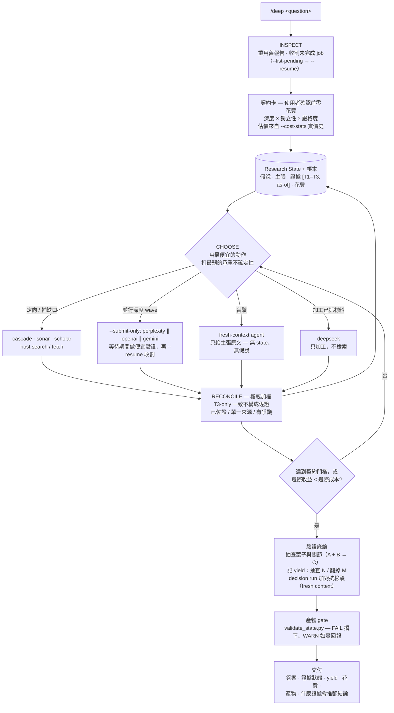

# claude-research-cascade

[English](README.md) | **繁體中文**

[](LICENSE)
[](HARNESS.md)
[](HARNESS.md)

`/deep` 是給可使用工具的 LLM Agent 使用的明確 **meta-research trigger**。

只有使用者明確輸入 `/deep` 時才啟動。它不是固定流程的「深度研究」工具。它會把宿主 Agent，例如 Claude Code、Codex，或其他具備工具能力的 Agent，變成研究流程的 **Organizer**，在一次有邊界、有狀態、可稽核的研究工作中調度多種 worker：低成本查證、學術搜尋、深度研究 API，以及只處理既有檔案的整理器。

核心目標很直接：**用每一美元換到最多有用資訊**，同時讓主張可追溯、衝突可見，並把昂貴呼叫留給真正能降低不確定性的地方。

主要宿主：**Claude Code**。Codex 是同一套 Organizer protocol 的 secondary binding。

## 為什麼需要它

常見的 deep research 工作流多半是單一引擎、一次性輸出，而且難以稽核。這個 harness 把研究視為反覆迭代的證據循環：

| 原則 | 意義 |
|---|---|
| 先定契約 | 花錢前先定義深度、獨立性門檻與嚴格程度 — 契約卡上直接看得到估價。 |
| 狀態落盤 | 證據、花費、爭議與決策寫進 Research State 檔案 + append-only 帳本。 |
| Worker affordances | 先選足夠便宜的工具；只有證據需要時才升級昂貴 worker。 |
| 權威加權證據 | 來源帶 tier（T1 source of record / T2 二手 / T3 aggregator）與時點（`as-of`）；T3 堆再多也不構成佐證。 |
| 主張層級對帳 | 逐條標記主張為已佐證、單一來源、有爭議或已淘汰。 |
| 驗證底線 | 抽查承重主張**與它們之間的推論關節**；回報 yield（抽查 N 條 / 翻掉 M 條）。 |
| 錢不蒸發 | Async 提交當下落帳；session 死掉靠 resume token 收割回來；抽取失敗保留原始 payload。 |
| 宿主中立 | Runtime spine 在 `HARNESS.md`；worker 細節與 scenarios 需要時才載入。 |

## Repo 結構

| 檔案 | 用途 |
|---|---|
| [HARNESS.md](HARNESS.md) | 短版宿主中立 Organizer spine：contract、state、loop、verification、delivery 與 boundary。 |
| [WORKERS.md](WORKERS.md) | Worker reference：affordance catalog、CLI contract、parallelism、rate limits、privacy 與 recovery。 |
| [SCENARIOS.md](SCENARIOS.md) | `/deep` 行為校準案例與 forward-test prompts。 |
| [SKILL.md](SKILL.md) | Claude Code binding。註冊 `/deep` 並把 harness primitive 對應到 Claude Code 工具。 |
| [AGENTS.md](AGENTS.md) | Codex binding。說明 discovery、安裝接線方式與 Codex 的操作規則。 |
| [scripts/deep_research.py](scripts/deep_research.py) | 內建 worker CLI。一次呼叫就是一次 action；支援可恢復任務；stdout 輸出 JSON。 |
| [scripts/doctor.py](scripts/doctor.py) | 本機 readiness check：Python、套件、API keys、provider availability、reports 可寫性、未收割 async jobs。 |
| [scripts/validate_transcripts.py](scripts/validate_transcripts.py) | Golden `/deep` transcripts 的結構驗證器。 |
| [scripts/validate_state.py](scripts/validate_state.py) | 真實 session 的產物 gate：contract 三軸、evidence status、spend 對帳、pending jobs。 |
| [examples/quickstart](examples/quickstart) | no-network demo path 產生的 sample state、ledger、report。 |
| [examples/transcripts](examples/transcripts) | quick fact、literature review、decision-critical 三種 `/deep` golden transcripts。 |
| [requirements.txt](requirements.txt) | Network workers 與 `.env` 載入所需的常用 Python dependencies。 |
| [.env.example](.env.example) | Worker provider 的 API key 範本。 |

## 運作方式



## 研究契約

每次 `/deep` 都必須請使用者確認三個獨立軸線。Organizer 應該先從上下文推斷推薦 preset，但在 contract 被確認前不應花 worker 成本。Preset 是組合捷徑，不是硬編碼預算。

| 軸線 | 選項 |
|---|---|
| 深度 | `shallow`：一波 probe 或快速回答 / `medium`：probe 加上一兩份標準 report / `deep`：多個深度引擎並反覆迭代 |
| 獨立性門檻 | 單一來源可接受 / 承重主張需要 2+ 來源 / 2+ index family 加上一輪盲驗 |
| 嚴格程度 | 第一個滿意答案即可 / 補齊明顯缺口 / 追爭議直到解決或證明不可解 |

Harness 使用的 preset：

| Preset | 組成 | 適合情境 |
|---|---|---|
| `fast` | shallow + 單一來源可接受 + 第一個滿意答案即可 | 低成本 fact-check 或快速建立方向感。 |
| `standard` | medium + 2-source bar + 補齊明顯缺口 | 一般研究、帶引用摘要、日常判斷。 |
| `decision` | deep + 跨 index family 盲驗 + 追爭議 | 高風險或會影響決策的研究。 |

Repo 裡的美元數字只代表當前清單價格下的概略估算。程式會記錄 provider 回傳的成本資訊，但不會強制執行預算上限。

## Worker Affordances

Workers 是 Organizer 可選用的工具，不是固定 pipeline 階段。沒有固定順序；選擇能降低最弱承重不確定性的最低成本 action。下表只是 GitHub overview；真正執行時的 reference 在 [WORKERS.md](WORKERS.md)。

| Provider | 角色 | Index family | 典型成本 | 典型時間 |
|---|---|---|---|---|
| `demo` | 本機 no-network smoke test，用來驗證 JSON/report/ledger contract | 無 | 免費 | 立即 |
| `cascade` | 四角度快速偵察：直接回答、反證、版圖、推翻條件 | Perplexity | ~$0.10-0.15 | ~30 秒 |
| `sonar` | 快速 grounded lookup，用於小缺口或 spot check | Perplexity | ~$0.01 | 數秒 |
| `scholar` | Semantic Scholar 文獻搜尋 | Semantic Scholar | 免費 | 數秒 |
| `perplexity` | 長篇、有引用的 deep-research report | Perplexity | ~$0.5-1 | 2-5 分鐘 |
| `openai` | 使用 OpenAI deep-research models 的長篇、有引用 report | OpenAI | ~$0.4-8 | 5-25 分鐘 |
| `gemini` | Gemini Deep Research report | Google | 視 provider 而定 | 3-10 分鐘 |
| `deepseek` | 只處理檔案：合併、抽取、比較既有 artifacts | 無 | 近乎免費 | 1-5 分鐘 |

重要：`deepseek` 在這個 harness 裡不是 retrieval worker。它只應處理已經抓回來的材料，不應用來憑空產生新證據。stdout JSON、ledger、resume、parallelism 與 recovery 規則請見 [WORKERS.md](WORKERS.md)。

## 安裝

### Claude Code

Claude Code 是主要宿主。把 repo clone 到 Claude Code 的 skills 目錄。之後 `/deep` 會被當成 skill 探測到。

```bash
git clone https://github.com/jechiu16/claude-research-cascade ~/.claude/skills/deep
```

### Codex

Codex 是 secondary binding。把 repo clone 到任意位置，然後讓你的專案能發現它。Codex 會從 session working directory 往上尋找 `AGENTS.md`；它不會掃描 `~/.claude/skills/`。

```bash
git clone https://github.com/jechiu16/claude-research-cascade ~/tools/research-cascade
export DEEP_HARNESS_DIR=~/tools/research-cascade
```

接著在你的專案根目錄加一個短版 `AGENTS.md` stub：

```md
For `/deep` research, read `<absolute path>/HARNESS.md` and `<absolute path>/AGENTS.md`.
Workers live at `<absolute path>/scripts/deep_research.py`.
```

完整的 Codex 安裝與操作注意事項請見 [AGENTS.md](AGENTS.md)。

### 其他宿主

把 repo clone 到任意位置。宿主 Agent 先讀 [HARNESS.md](HARNESS.md)；只有在選擇或執行 worker 時才讀 [WORKERS.md](WORKERS.md)。

## 30 秒 Smoke Test

這會驗證本機 worker contract，不需要 API key、不打網路、不花錢：

```bash
python scripts/doctor.py
python scripts/deep_research.py --provider demo \
  --ledger reports/deep_state_demo.ledger.jsonl \
  "smoke test"
```

預期結果：`doctor.py` 會列出 provider readiness；demo worker 會在 stdout 印出單一 JSON object，在 `reports/` 寫入 report，並 append 一行 ledger。範例產物請見 [examples/quickstart](examples/quickstart)。

## Golden Transcript 驗證

Golden transcripts 展示 quick fact、literature review、decision-critical 三種 `/deep` session 應該長什麼樣子。用下面指令檢查結構：

```bash
python scripts/validate_transcripts.py
```

## Worker 依賴

安裝共用依賴：

```bash
pip install -r requirements.txt
```

Gemini 支援另外需要：

```bash
pip install google-genai
```

從範本建立本機 `.env`：

```bash
cp .env.example .env
```

API key 解析順序：

1. Process environment
2. 從目前 working directory 往上找到的最近 `.env`
3. Harness checkout 旁邊的 `.env`

支援的 key：

| Key | 用途 |
|---|---|
| `PERPLEXITY_API_KEY` | `sonar`、`cascade`、`perplexity` |
| `OPENAI_API_KEY` | `openai` |
| `GEMINI_API_KEY` | `gemini` |
| `DEEPSEEK_API_KEY` | `deepseek` |
| `S2_API_KEY` | `scholar`，選填；不填也能用，但會受更嚴格的 shared limit 影響 |

## Worker CLI

先選擇已安裝依賴的 Python interpreter：

```bash
# Windows
PY=.venv/Scripts/python.exe

# POSIX
PY=.venv/bin/python

# 沒有 virtualenv
PY=python3
```

直接執行 worker：

```bash
python scripts/doctor.py
python scripts/validate_transcripts.py
"$PY" scripts/deep_research.py --provider demo --ledger reports/deep_state_demo.ledger.jsonl "smoke test"
"$PY" scripts/deep_research.py --provider sonar "quick question"
"$PY" scripts/deep_research.py --provider cascade "scout this research question"
"$PY" scripts/deep_research.py --provider scholar "dynamic factor model nowcasting"
"$PY" scripts/deep_research.py "standard research question"
"$PY" scripts/deep_research.py --provider openai --effort high "decision-critical question"
"$PY" scripts/deep_research.py --provider deepseek --files a.md --files b.md "merge into a claims table"
"$PY" scripts/deep_research.py --provider openai --submit-only "提交即返回，稍後收割"
"$PY" scripts/deep_research.py --resume "openai:resp_abc123"
"$PY" scripts/deep_research.py --list-pending
"$PY" scripts/deep_research.py --cost-stats
"$PY" scripts/validate_state.py reports/deep_state_20260709_topic.md
```

輸出契約：

| Stream | 契約 |
|---|---|
| stdout | 單一 JSON 物件。成功時包含 `report`、`report_path`、`usage`、`cost_estimate_usd`、`wall_time_s`。 |
| stderr | 只放進度訊息，包含 async resume token。 |
| files | Report 會存到 `<cwd>/reports/deep_<timestamp>_<slug>.md`。 |

中等深度以上的研究，建議傳入 ledger 路徑，讓 worker 追加機器可讀的花費紀錄：

```bash
"$PY" scripts/deep_research.py \
  --provider cascade \
  --ledger reports/deep_state_topic.ledger.jsonl \
  "research question"
```

## 實務筆記

### Durability 與恢復

- 帶 `--ledger` 時，async 提交會在提交當下就落帳（`event: submitted`）— process 被殺也不會丟已付費的 resume token；`--list-pending`（以及 `doctor.py`）會列出未收割的 job。
- Async poll 失敗時會回傳含有 `error` 與 `resume` 的 JSON；Organizer 應該 resume，而不是重新付費提交。
- `--submit-only` 提交即返回 — 一輪齊發多個引擎，趁它們跑的時候做便宜驗證，再逐一 `--resume` 收割。
- Completed job 的抽取若失敗，原始 provider payload 會先存進 `reports/deep_raw_*.json` — 已付費內容不因 schema 漂移而蒸發，修好後 `--resume` 零成本重收割。
- `--cost-stats` 從你自己的帳本聚合 per-provider 實價 — 契約卡估價用你的價格史，不用 README 裡會腐爛的參考數字。
- Report 檔名包含 `query + pid` 的短 hash，避免平行 probe 或純 CJK query 互相覆蓋。

### Provider 行為

- 在這個 workflow 裡，Perplexity `reasoning_effort=minimal` 視為 ungrounded：它可能計費搜尋，卻不回傳引用。真正研究請用 `medium` 或更高。
- Perplexity 會回傳官方 `usage.cost.total_cost`，worker 照實報告；OpenAI 不回傳 cost field，worker 用 token 數和 web-search call 數估算。
- OpenAI deep-research models 需要 verified organization。
- Semantic Scholar 應該收到 keyword phrases，而不是自然語言問題；也不要平行呼叫。Worker 會 retry 暫時性的 GET 失敗，並回傳結構化 paper sources 方便 handoff。
- Gemini 使用 worker 目標支援的 Interactions API `steps` schema，並需要 `google-genai`。

### 交付

- 最終交付偏 handoff artifact：contract、帶 tier 與時點的證據狀態、驗證 yield、花費、產物與下一步檢查點。

## 狀態

這是一個 harness 與 host binding，不是打包好的 Python library。核心行為寫在 Markdown 規格裡，並由擔任 Organizer 的宿主 Agent 執行。

## License

[MIT](LICENSE)
