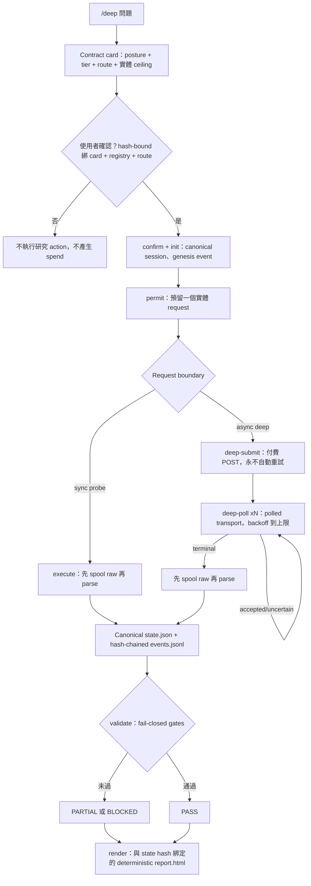

# claude-research-cascade

[English](README.md) | **繁體中文**

[](LICENSE)
[](HARNESS.md)
[](research_harness)

`/deep` 是給 tool-using coding agent 使用的 explicit-trigger research runtime。輸入字面上的 `/deep` 會讓當下的宿主模型成為一次有邊界 session 的 **Organizer**——負責 frame 問題、選擇 check、reconcile evidence——同時由另一層獨立的 mechanical layer 強制這個 envelope：使用者必須確認、且與其看到的 card、provider registry、route records 完全 hash-bound 的 research contract；把關每個實體 request 的 permit；append-only、hash-chained 的 event journal；唯一一份 canonical JSON state document；fail-closed 的 validation gate；以及只從該 state 產生、不摻雜其他內容的 deterministic HTML report。

## 30-Second Quickstart

零 network、零 key、零成本——透過 no-network 的 `demo-probe` route 跑完整個 permit → request-boundary → occurrence → validate → render 迴圈：

```bash
PY=python3   # 任何裝好 requirements.txt 的 interpreter 都可以
"$PY" scripts/research_state.py demo /tmp/deep-demo --json
```

預期 stdout 會有 `"validation_ok": true`，並產生 `/tmp/deep-demo/report.html`。`demo-probe` route 永遠不能支持真正的 claim——registry validation 會 hard-fail——所以這只證明機器本身跑得動，不是一個研究結論。

真實 session 會跑同樣的 primitive，一次一個 permit-gated 步驟：

```bash
SESSION=/tmp/deep-session

# 1. prepare —— normalize 並 hash 未確認的 card
"$PY" scripts/research_state.py prepare --contract draft.json --json > prepared.json

# 2. confirm —— 使用者對剛顯示的 hash 扣板機
"$PY" scripts/research_state.py confirm --prepared prepared.json \
  --card-sha256 "<card>" --registry-sha256 "<registry>" --referenced-records-sha256 "<routes>" \
  --confirmed-at "$(date -u +%Y-%m-%dT%H:%M:%SZ)" --confirmed-by user --json > confirmed.json

# 3. init —— canonical session 目錄 + genesis event
"$PY" scripts/research_state.py init "$SESSION" --question "<question>" --contract confirmed.json --json

# 4. permit —— 預留一個精確的實體 request
"$PY" scripts/research_state.py permit "$SESSION" --action-id A1 --stage primary_scout \
  --category probe --route sonar --count 1 --fingerprint "user-approved:sonar:A1" --json

# 5. execute —— 先 spool raw payload 再 parse
"$PY" scripts/research_state.py execute "$SESSION" --action-id A1 --query "<query>" --json

# 6. validate 再 render —— fail-closed gate、deterministic report.html
"$PY" scripts/research_state.py validate "$SESSION" --json
"$PY" scripts/research_state.py render "$SESSION" --json
```

## 架構



每個 session 擁有四個不互相競爭的 artifact：

| 路徑 | 用途 |
|---|---|
| `state.json` | 唯一的 canonical semantic state |
| `events.jsonl` | append-only、sequence-numbered、hash-chained 的操作與 revision |
| `raw/` | 帶 hash、size、sensitivity、retention、provenance 的 immutable ingested bytes |
| `report.html` | 與 canonical state hash 綁定的 deterministic 人類報告 |

系統不會再產生第二份完整 Markdown 報告。Agent 從 canonical JSON 讀 semantic state；需要完整 provider bytes 時，再沿 spool/artifact reference 讀取。人類看 HTML，也不需要再多一層模型摘要。

## Invariants

以下是 runtime 用機械方式強制的保證，不是靠慣例：

| Invariant | 強制機制 |
|---|---|
| 使用者扣下 spend 的板機 | `confirm` 要求使用者看到的 card、registry、route-record hash 完全一致；任何 drift 都會產生新 session，不會重新解讀舊的 |
| 一個 permit 等於一個實體 request | `permit` 預留精確數量；失敗或 uncertain 的嘗試一樣會消耗掉——這裡沒有退款 |
| 付費 submission 永不自動重試 | `deep-submit` 是單一一次付費 POST；timeout 或 crash 會把 job 標成 `uncertain`，不會默默重送 |
| Raw payload 一律先 spool 再 parse | `execute`、`deep-submit`、`deep-poll` 都會先把 provider byte stream 寫進 `provider_spool/`，才開始 parse |
| Occurrence 由 code 寫入，絕不是 model prose | request boundary 自己組出每一筆 `retrieval_occurrence`；Organizer 沒辦法自己生一筆 |
| Demo route 永遠不能支持 claim | 只要 `no_network_demo` route 宣稱 `can_support_claims: true`，registry validation 就會 hard-fail |
| Credential 絕不會進入 state、fixture 或 fingerprint | key 只從 `env`/`.env` 解析；fingerprint 只 hash query，不 hash credential；ingest 進來的 bytes 都會過一次 deterministic 的 secret-pattern 檢查 |
| `PASS` 是 non-vacuous 的 | 必須有非空 bounded answer、符合 contract 的 evidence floor、完整 claim→evidence→source-origin lineage；High 還要求有沒有產生 candidate 的 context-separated verifier |

## Route Status

[`research_harness/provider_registry.json`](research_harness/provider_registry.json) 是 capability 與 policy ledger，不是 pipeline。`.env` 裡有 key 只代表這條 route *eligible*，不代表它 *enabled*。只要 `enabled: true` 的 route 缺少真正的 adapter binding、active 的 lifecycle，或者（external `v2_request_boundary` route 的話）沒有非空 adoption evidence，registry validation 就會 hard-fail。目前 enabled 的 external route 是 `sonar`、`github`、`pypi`、`scholar`、`openalex`、`crossref`、`nvd`、`europe-pmc`、`ietf`、`osv`、`brave`，以及 async 的 `perplexity` deep-engine route。`exa` 已接上相同 boundary 並通過 fixture/live validation，但在獨立索引 paired benchmark 完成前仍預設 disabled。下面其他 route 仍是未採用的 candidate。

透過 `research_harness.providers.load_provider_registry()`（跟 runtime 用的是同一個 loader）讀出 registry，印出每筆記錄的 `id`、`roles`、`index_family`、`enabled`、`execution_binding` 產生：

| id | roles | index family | enabled | binding |
|---|---|---|---|---|
| `brave` | scout, challenge | brave | yes | `v2_request_boundary` |
| `crossref` | scholarly-scout | crossref | yes | `v2_request_boundary` |
| `demo-cascade` | contract-test | demo | yes | `no_network_demo` |
| `demo-probe` | contract-test | demo | yes | `no_network_demo` |
| `europe-pmc` | biomedical-scout | europe-pmc | yes | `v2_request_boundary` |
| `github` | source-of-record | github | yes | `v2_request_boundary` |
| `host` | organizer, auditor | not_applicable | yes | `host_native_observed` |
| `host-web` | scout, verifier, fetch | host-opaque | yes | `host_native_observed` |
| `ietf` | source-of-record | ietf | yes | `v2_request_boundary` |
| `local` | scout, verifier, experiment | local-project | yes | `local` |
| `nvd` | source-of-record | nvd | yes | `v2_request_boundary` |
| `openalex` | scholarly-scout | openalex | yes | `v2_request_boundary` |
| `osv` | source-of-record | osv | yes | `v2_request_boundary` |
| `perplexity` | investigation | perplexity-aggregated | yes | `v2_request_boundary` |
| `pypi` | source-of-record | pypi | yes | `v2_request_boundary` |
| `scholar` | scholarly-scout | semantic-scholar | yes | `v2_request_boundary` |
| `sonar` | scout, challenge | perplexity-aggregated | yes | `v2_request_boundary` |
| `cascade` | composite-scout | perplexity-aggregated | no | `legacy_unbound` |
| `deepseek` | processor, blind-auditor | not_applicable | no | `legacy_unbound` |
| `exa` | semantic-scout | exa | no | `v2_request_boundary` |
| `firecrawl` | fetch | not_applicable | no | `legacy_unbound` |
| `gemini` | investigation | google | no | `legacy_unbound` |
| `jina` | fetch | not_applicable | no | `legacy_unbound` |
| `mojeek` | scout, challenge | mojeek | no | `legacy_unbound` |
| `openai` | investigation | openai-model-mediated | no | `legacy_unbound` |
| `test-only-unbound-candidate` | candidate | unknown | no | `legacy_unbound` |

*26 個已登記 route 中有 17 個 enabled，as of commit `c808c4b`。*

其餘的 adoption 順序——先做 Exa 對比其他獨立索引的 benchmark，最後只有在實測 fetch failure 後才上 Jina/Firecrawl——記錄在 [`docs/superpowers/specs/2026-07-10-provider-portfolio-design.md`](docs/superpowers/specs/2026-07-10-provider-portfolio-design.md)。

## Credentials and Spend

Provider key 的解析順序是 process environment，再來最近的 `.env`——把 [`.env.example`](.env.example) 複製成 `.env`，填你有的就好。有 key 只代表 route *eligible*；要靠上面的 registry gate 才會 *enabled*。

Spend authority 在使用者手上，不在 key 手上。`confirm` 是唯一能把 contract 變成 session 的指令，而且只有在三個 hash 跟 `prepare` 顯示的內容逐 byte 相符時才會成功；改動 card、registry，或任何被引用的 route record，都會逼出一個新 session，不會默默重新解讀舊的。

Cost 只會用區間揭露，絕不當成可強制的上限。Contract 的 `estimated_spend_usd` 明確標示不確定，因為一次 logical call 背後的 provider-side 工作量會變動；真正可強制的單位是實體 request count，不是金額上限。一個 request 完成後，occurrence 的 `cost_usd`——如果 adapter 讀得到——就是 provider 回報的數字：`sonar`/`perplexity` 讀 `usage.cost.total_cost`，`openalex` 讀 `meta.cost_usd`，`exa` 讀 `costDollars.total`；`github`、`pypi`、`scholar` 這類免費 route 則回報 `null`，不會用猜的。

Credential 絕不會進入 canonical state、event、spool 檔名、fixture，或 request fingerprint。Adapter 只 fingerprint query，不 fingerprint key；任何 ingest 進來、bytes 符合 deterministic secret pattern 的 artifact——API key assignment、PEM private key、已知 provider key prefix——都會在落地前被拒絕。

## Research Contract

使用者同時控制研究邏輯與成本暴露。

### Posture

- `lookup`：由 source of record 定義的 bounded fact
- `synthesis`：landscape、evidence map 或 literature review
- `scientific`：競爭機制與 discriminating observation
- `decision`：會推動 architecture/action，必須審核 premises 與 inference joints

### Tier

- `low`：窄、可逆、單 cycle
- `medium`：development-grade evidence，加上事後補強 reserve
- `high`：模糊、困難或難逆決策，加上額外 challenge 與 fresh-context verification
- `custom`：使用者指定精確 stage/count map

Tier 不控制 provider 內部 token 用量或單次確切價格；真正可強制的是 physical request count。Contract card 另外揭露 host context、local work、估價不確定性、raw-storage ceiling 與 reserved calls。

## Field Notes: v2

**Durability。** 每次 state 寫入都是 crash-consistent：換檔前，pending transaction 檔案會先記下前後兩個 state hash，所以 `recover` 能 deterministic 地把中斷的寫入 roll forward 或 roll back，而不是用猜的，而且只會碰自己 owned、malformed 的 tail。`events.jsonl` 是 append-only、hash-chained。Provider bytes 會先 spool 再 parse。中斷的 async deep-research job 不會被重送：它的 provider job token 在 accept 當下就寫進 journal；之後每次 `deep-poll` 只做一次已取得 permit 的 poll。15s → 30s → 60s → 120s 封頂的 cadence 由 Organizer 負責，不是 CLI 自動 sleep/retry。

**Demo 同時是 test。** `research_state.py demo` 不是錄好的假 transcript——`tests/test_demo_flow.py` 呼叫的是同一個 `main(["demo", ...])` entry point，並且對它的 JSON output、spool 檔、occurrence 欄位做 assert。手動跑一次跟在 CI 跑一次，走的是同一條 code path。

**要寫新 adapter？** 從 [`research_harness/adapters/README.md`](research_harness/adapters/README.md) 開始。裡面寫清楚 two-function 的 adapter contract、fixture 需求（一筆錄下來的真實回應，加上至少兩筆錄下來的失敗），以及之前寫 adapter 時已經踩過的限制。

**已知限制。** 每次操作的成本會隨累積 event-journal 長度增長：每個操作都會完整重讀一次 `events.jsonl`，並對每一筆 event 做 hash-chain verification，而且沒有 compaction。針對真實的 `_read_events_unlocked`/`_event_chain_errors` path 實測：每筆 journaled event 的邊際成本大約 0.005ms，所以一個 session 大概要累積到 20 萬筆 event，單次操作才會逼近 1 秒。長時間跑的 session 應該拆開，不要放任單一 journal 無限成長。

## Repo 地圖

| 路徑 | 用途 |
|---|---|
| [HARNESS.md](HARNESS.md) | Host-neutral v2 Organizer protocol |
| [SKILL.md](SKILL.md) | Claude Code `/deep` binding |
| [AGENTS.md](AGENTS.md) | Codex `/deep` binding |
| [research_harness](research_harness) | Contract、state、storage、quota、artifact、boundary、validation、rendering primitives |
| [research_harness/adapters](research_harness/adapters) | 每個 provider 一個 module；[README.md](research_harness/adapters/README.md) 是開發指南 |
| [scripts/research_state.py](scripts/research_state.py) | 主要 v2 JSON-first CLI |
| [scripts/validate_state.py](scripts/validate_state.py) | V2 gate + 保留的 legacy Markdown validator |
| [scripts/render_report.py](scripts/render_report.py) | Thin deterministic renderer CLI |
| [research_harness/provider_registry.json](research_harness/provider_registry.json) | Versioned provider portfolio 與 route policy |
| [WORKERS.md](WORKERS.md) | Legacy worker 行為與未來 adapter 參考 |
| [examples/v2](examples/v2) | 已確認、無付費 provider 的 foundation example |
| [docs/superpowers/specs](docs/superpowers/specs) | 設計與 provider-portfolio rationale |

## 安裝

### Claude Code

```bash
git clone https://github.com/jechiu16/claude-research-cascade ~/.claude/skills/deep
```

Claude Code 會發現 [SKILL.md](SKILL.md)。執行時使用 project venv 或已安裝 `requirements.txt` 的 interpreter。

### Codex

可安裝成全域 Codex skill，或 clone 到固定位置：

```bash
git clone https://github.com/jechiu16/claude-research-cascade ~/tools/claude-research-cascade
export DEEP_HARNESS_DIR=~/tools/claude-research-cascade
```

Codex 也會從 project hierarchy 讀取 [AGENTS.md](AGENTS.md)。Binding 內有 project stub 與 absolute-path invocation 說明。

## Organizer CLI

```text
providers       顯示不含 secret value 的 registry capability
prepare         normalize 並 hash 未確認的 contract card
confirm         使用者選擇後綁定剛顯示的 card
init            建立 canonical state 與 genesis event
patch           套用 revision-checked Organizer patch
permit          預留精確 physical requests
demo            一鍵、no-network 跑完整個 loop（permit -> occurrence -> report.html）
execute         透過 v2 request boundary 執行一個已 permit 的 probe
deep-submit     送出 async deep-research job（付費 POST，永不重試）
deep-poll       對 accepted/uncertain 的 deep job 做一次實體 poll
deep-timeout    免費的 wall-clock 檢查：把卡住的 deep action 標成 uncertain
deep-pending    免費：列出 accepted/uncertain 的 deep action 與其 job token
status          顯示 state、quota use、validation
artifact-add    安全 ingest local/user/fetched-source bytes
artifact-purge  降級、purge、validate、rerender
recover         恢復 WAL 與已授權 pending purge
validate        執行 structure、lineage、quota、artifact、verdict gates
render          atomic 寫入 deterministic report.html
view            開啟目前報告
```

成功 command 加上 `--json` 時，stdout 只輸出一個 JSON object；error 與 progress 寫入 stderr。

## Legacy v1 Workers

`scripts/deep_research.py`、`doctor.py`、legacy Markdown examples，與 [WORKERS.md](WORKERS.md) 暫時保留，供相容與 adapter migration 使用。它們不能證明 v2 enforcement：

- credential check 綠燈不會啟用 registry route；
- legacy call 不會取得 v2 permit；
- legacy raw payload path 不符合 v2 provenance/storage-rights gate；
- foundation test suite 完全不需要付費 legacy call。

## 驗證

```bash
PY=python3   # 任何裝好 requirements.txt 的 interpreter 都可以

"$PY" -m unittest discover -s tests -v
"$PY" -m py_compile research_harness/*.py scripts/*.py
"$PY" scripts/validate_transcripts.py --json
```

Deterministic suite 包含可通過的 Medium lookup、High decision，以及 false `PASS`、quota、corruption、secret、provenance、stale report、purge recovery、XSS、CLI boundary 等案例。付費 paired evaluation 與 external provider adoption 是另外需要使用者確認 call budget 的 follow-on。

## License

[MIT](LICENSE)
