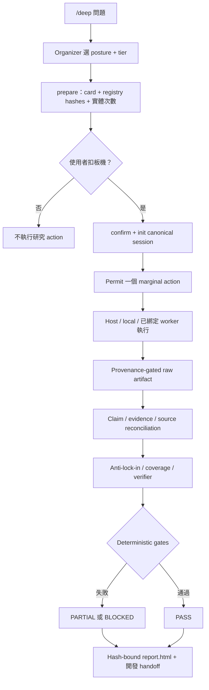

# claude-research-cascade

[English](README.md) | **繁體中文**

[](LICENSE)
[](HARNESS.md)
[](research_harness)

`/deep` 是給 coding agent 使用的明確 meta-research trigger。它讓當下選用的宿主模型成為一次有邊界研究 session 的 **Organizer**：執行前由使用者選擇 epistemic posture、tier、route 與實體呼叫次數；runtime 再負責保存 claim lineage、強制 request permit、驗證 evidence gate，並產生 deterministic HTML handoff。

它不是另一個宣稱「長報告更好」的模型。它提供的是較窄且可測試的保證：沒有證據的 `PASS`、隱藏 call expansion、缺 provenance 的 artifact、過期報告，以及不安全的證據刪除都會 fail closed。

## 目前狀態

V2 foundation 已支援：

- 由使用者確認且 hash-bound 的 research contract；
- versioned provider registry 與 immutable route snapshot；
- canonical JSON state 與 hash-chained event journal；
- logical invocation 與 physical request 的精確 permit；
- immutable、secret-rejecting、provenance-gated raw artifact；
- crash-safe state/event recovery 與已授權 purge recovery；
- fail-closed 的 `PASS`、`PARTIAL`、`BLOCKED` validation；
- 與 canonical state hash 綁定、經 escaping 的 deterministic `report.html`；
- host-neutral、JSON-first 的 Organizer CLI。

**本 foundation slice 的 external provider 與 processor route 全部是 disabled。** API key 可以已存在，legacy credential doctor 也可能顯示 ready，但 credential readiness 不等於 v2 execution readiness。Worker route 必須先整合共用 v2 request boundary，並通過 provenance、recovery、policy、adoption fixtures 才能啟用。V2 session 不可直接呼叫 legacy worker CLI 繞過 registry。

## 主要差異

| 常見失敗 | V2 的處理 |
|---|---|
| 一份長報告藏住脆弱前提 | 承重 claim 必須追到 evidence、source origin 與 raw bytes |
| 多個模型重複同一上游來源 | retrieval/model diversity 與 source-origin independence 分開計算 |
| Tier 暗中展開更多 calls | 使用者確認每個 stage 與 provider multiplicity 的實體次數 |
| 更多模型層造成更多幻覺 | Canonical JSON 是唯一語意真相；HTML 由 deterministic code 產生 |
| 空 claim set 也能形式上通過 | `PASS` 必須有非空 bounded answer 與 evidence floor |
| 初步答案造成 framing lock-in | Medium/High scientific、decision 預留 anti-lock-in 與 coverage check |
| High 只在原本 context 自我審核 | High `PASS` 要求沒有產生 candidate 的 context-separated verifier |
| Raw evidence 被刪掉後 verdict 不變 | Purge 先降級 state，再刪 bytes，並留下可恢復授權與 tombstone |
| 有 key 就當 provider 可安全使用 | Registry binding、storage rights、fixtures、adoption evidence 分別是 hard gate |

## 架構



每個 session 只有四類不互相競爭的 artifact：

| 路徑 | 用途 |
|---|---|
| `state.json` | 唯一 canonical semantic state |
| `events.jsonl` | append-only、sequence-numbered、hash-chained 的操作與 revision journal |
| `raw/` | 帶 hash、size、sensitivity、retention、provenance 的 immutable bytes |
| `report.html` | 含 canonical state hash 的 deterministic 人類報告 |

系統不再產生第二份完整 Markdown 報告。Agent 直接讀 JSON，不會丟失欄位；人類看 HTML，也不需要再增加一次模型摘要層。

## Research Contract

使用者同時控制研究邏輯與成本暴露。

### Posture

- `lookup`：由 source of record 定義的 bounded fact；
- `synthesis`：landscape、evidence map 或 literature review；
- `scientific`：競爭機制與 discriminating observation；
- `decision`：會推動 architecture/action，必須審核 premises 與 inference joints。

### Tier

- `low`：窄、可逆、單 cycle；
- `medium`：development-grade evidence，加上事後補強 reserve；
- `high`：模糊、困難或難逆決策，加上額外 challenge 與 fresh-context verification；
- `custom`：使用者指定精確 stage/count map。

Tier 不假裝能控制 provider 內部 token 或單次確切價格。真正可強制的是 physical request count。Contract card 另外揭露 host context、local work、估價不確定性、raw-storage ceiling 與 reserved calls。

## Repo 地圖

| 路徑 | 用途 |
|---|---|
| [HARNESS.md](HARNESS.md) | Host-neutral v2 Organizer protocol |
| [SKILL.md](SKILL.md) | Claude Code `/deep` binding |
| [AGENTS.md](AGENTS.md) | Codex `/deep` binding |
| [research_harness](research_harness) | Contract、state、storage、quota、artifact、validation、rendering、operations |
| [scripts/research_state.py](scripts/research_state.py) | 主要 v2 JSON-first CLI |
| [scripts/validate_state.py](scripts/validate_state.py) | V2 gate + 保留的 legacy Markdown validator |
| [scripts/render_report.py](scripts/render_report.py) | Thin deterministic renderer CLI |
| [research_harness/provider_registry.json](research_harness/provider_registry.json) | Versioned provider portfolio 與 route policy |
| [WORKERS.md](WORKERS.md) | Legacy worker 行為與未來 adapter 參考 |
| [examples/v2](examples/v2) | 已確認、無付費 provider 的 foundation example |
| [docs/superpowers/specs](docs/superpowers/specs) | 設計與 provider-portfolio rationale |

## 安裝

### Claude Code

```bash
git clone https://github.com/jechiu16/claude-research-cascade ~/.claude/skills/deep
```

Claude Code 會發現 [SKILL.md](SKILL.md)。執行時使用 project venv 或已安裝 `requirements.txt` 的 interpreter。

### Codex

可安裝成全域 Codex skill，或 clone 到固定位置：

```bash
git clone https://github.com/jechiu16/claude-research-cascade ~/tools/claude-research-cascade
export DEEP_HARNESS_DIR=~/tools/claude-research-cascade
```

Codex 也會從 project hierarchy 讀取 [AGENTS.md](AGENTS.md)。Binding 內有 project stub 與 absolute-path invocation 說明。

## V2 Quick Start

以下 smoke 不會產生付費 provider call，也不會執行 external worker request：

```bash
PY=/Users/jechiu/dev/parallax/.venv/bin/python
SESSION="$(mktemp -d)/session"

"$PY" scripts/research_state.py providers --json

"$PY" scripts/research_state.py init "$SESSION" \
  --question "Choose a cache" \
  --contract examples/v2/medium-contract.json \
  --json

"$PY" scripts/research_state.py validate "$SESSION" --json
"$PY" scripts/research_state.py render "$SESSION" --json
```

Repo 內的 confirmed contract 是 deterministic fixture。真實 `/deep` 必須先 `prepare`，把 card 與 hashes 顯示給使用者，等使用者選擇後才 `confirm` 與 `init`。

## Organizer CLI

```text
providers       顯示不含 secret value 的 registry capability
prepare         normalize 並 hash 未確認的 contract card
confirm         使用者選擇後綁定剛顯示的 card
init            建立 canonical state 與 genesis event
patch           套用 revision-checked Organizer patch
permit          預留精確 physical requests
status          顯示 state、quota use、validation
artifact-add    安全 ingest local/user/fetched-source bytes
artifact-purge  降級、purge、validate、rerender
recover         恢復 WAL 與已授權 pending purge
validate        執行 structure、lineage、quota、artifact、verdict gates
render          atomic 寫入 deterministic report.html
view            開啟目前報告
```

成功 command 加上 `--json` 時，stdout 只輸出一個 JSON object；error 與 progress 寫入 stderr。

## Provider Portfolio

Registry 是 capability/policy ledger，不是 hard-coded provider order。目前設計優先序：

1. canonical development fact 優先走 direct source-of-record API；
2. Brave 作為第一個 independent general-index candidate；
3. OpenAlex、Crossref、Europe PMC 補 scholarly coverage；
4. 依 query class 比較 Exa 與 Mojeek；
5. 只有 measured fetch failure 才導入 Jina 或 Firecrawl。

這些 provider 在 worker adapter 與 adoption evidence 完成前都維持 disabled。Generic Google + Brave 並發不是預設；第二條 route 必須用預期 unique-origin 或 decision value 證明額外 call count 合理。沒有 named adapter fixture 與 benchmark budget 前，不要求新 key。

## Legacy Workers

`scripts/deep_research.py`、`doctor.py`、legacy Markdown examples 與 `WORKERS.md` 暫時保留，供相容與 adapter migration 使用。它們不是 v2 enforcement proof：

- credential check 綠燈不會啟用 registry route；
- legacy call 不會取得 v2 permit；
- legacy raw payload path 不符合 v2 provenance/storage-rights gate；
- foundation test 完全不需要付費 legacy call。

## 驗證

```bash
PY=/Users/jechiu/dev/parallax/.venv/bin/python

"$PY" -m unittest discover -s tests -v
"$PY" -m py_compile research_harness/*.py scripts/*.py
"$PY" scripts/validate_transcripts.py --json
"$PY" /Users/jechiu/.codex/skills/.system/skill-creator/scripts/quick_validate.py .
```

Deterministic suite 包含可通過的 Medium lookup、High decision，以及 false `PASS`、quota、corruption、secret、provenance、stale report、purge recovery、XSS、CLI boundary 等案例。付費 paired evaluation 與 external provider adoption 是另外需要使用者確認 call budget 的 follow-on。

## License

[MIT](LICENSE)
