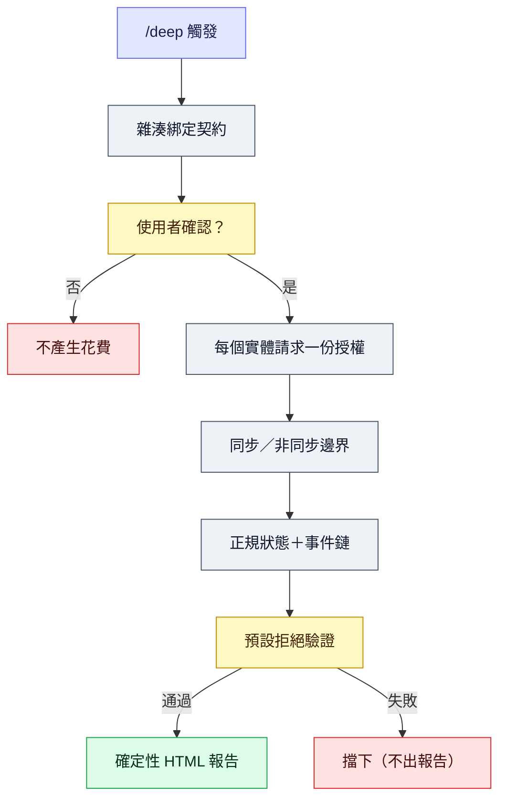

# Agent Deep Research Trigger

[](https://github.com/jechiu16/agent-deep-research-trigger/actions/workflows/ci.yml)
[](https://github.com/jechiu16/agent-deep-research-trigger/releases)
[](pyproject.toml)
[](LICENSE)

**給 Claude Code 與 OpenAI Codex 共用的 `/deep` 研究代理 skill。**
它把明確觸發轉成有邊界、成本可控、證據有 gate、可恢復的多 provider
研究 session，最後從唯一 canonical state 產生 deterministic report。

[English](README.md) ·
[Releases](https://github.com/jechiu16/agent-deep-research-trigger/releases)

## 目錄

- [為什麼需要它](#為什麼需要它)
- [關鍵術語](#關鍵術語)
- [Host 相容性](#host-相容性)
- [快速開始](#快速開始)
- [運作方式](#運作方式)
- [Provider routes](#provider-routes)
- [CLI](#cli)
- [Credential 與安全](#credential-與安全)
- [開發與 release 品質](#開發與-release-品質)
- [專案地圖](#專案地圖)

## 為什麼需要它

一般 research orchestration 常把重要限制留在 prompt prose：誰批准費用、哪一個
request 被授權、retry 是否重複付費、claim 從哪裡來，以及最後的 `PASS` 是否真的
通過 evidence floor。

Agent Deep Research Trigger 把這些限制做成可執行規則：

- 使用者先確認精確 research contract，外部 spend 才能開始；
- 每個 physical request 都消耗指定 stage／route 的 permit；
- 付費 async submission 絕不靜默重送；
- provider bytes 一律先 spool 再 parse；
- state update 有 revision check 並可在 crash 後恢復；
- claim 必須連回 evidence 與 source origin；
- 最終 verdict 只有在 fail-closed validation 通過 evidence floor 後才會 PASS；
- HTML 只從唯一 canonical JSON state deterministic render。

## 關鍵術語

後面的內容會固定使用這幾個精確術語，而不是「步驟」「呼叫」這類模糊說法：

| 術語 | 意義 |
|---|---|
| Organizer | 負責提出、確認並執行 research contract 的 agent 角色 |
| Contract | 使用者在任何 spend 發生前確認的精確、hash-bound research 計畫 |
| Posture | 研究模式：`lookup`、`synthesis`、`scientific` 或 `decision` |
| Tier | 成本／深度預算：`low`、`medium`、`high` 或 custom request envelope |
| Permit | 針對單一 physical request 的一次性授權 |
| Physical request | permit 授權、quota 計數的最小單位——一次 boundary execution，可能是 provider 網路呼叫，也可能是 deterministic 的 no-network route |

## Host 相容性

| Host | Discovery | Binding |
|---|---|---|
| [Claude Code](https://code.claude.com/docs/en/skills) | `SKILL.md`、`.claude/skills/deep/SKILL.md` | Permit 後使用 native search/fetch 與 local tools |
| [OpenAI Codex](https://developers.openai.com/codex/build-skills/) | `AGENTS.md`、`.agents/skills/deep/SKILL.md` | Permit 後使用 native web 與 shell/file tools |
| 其他 Agent Skills host | Root `SKILL.md` | `HARNESS.md` 的 host-neutral protocol |

研究 protocol 只有一份。Host files 只負責 native tool mapping，不定義另一套流程。

## 快速開始

從 clone repository 到確認一個 `/deep` request，請依序完成以下步驟：

1. Clone repository 並完成安裝：

```bash
git clone https://github.com/jechiu16/agent-deep-research-trigger.git \
  "$HOME/.agent-deep-research-trigger"
cd "$HOME/.agent-deep-research-trigger"

python3 -m venv .venv
.venv/bin/python -m pip install -e .
```

2. 可選地跑 no-network health check，不需要 API key 或成本：

```bash
.venv/bin/deep-research-state demo /tmp/agent-deep-demo --json
```

預期結果：

```json
{"validation_ok": true}
```

Demo 會走完 permit -> request boundary -> occurrence -> validation -> report；它的
no-network route 在結構上無法支援真實 claim。

3. 在設定 spend 前檢查 route readiness：

```bash
.venv/bin/deep-research-state providers
```

這個 deterministic human view 顯示 `ready`、`missing-key`、`disabled` 或
`unbound`，不會印出 credential。Machine consumer 請用
`.venv/bin/deep-research-state providers --json`。

4. 只設定預計使用的 key：

```bash
cp .env.example .env
# 編輯 .env，只加入預計使用的 provider key。
```

5. 將同一份 repository 連結到一個或兩個 host 的 skill 目錄：

```bash
mkdir -p "$HOME/.claude/skills" "$HOME/.agents/skills"
ln -s "$PWD" "$HOME/.claude/skills/deep"
ln -s "$PWD" "$HOME/.agents/skills/deep"
```

Repo 已包含 `.claude/skills` 與 `.agents/skills` 的 project-local discovery wrapper。

6. 建立連結後，開啟新的 Claude Code 或 Codex session，讓 host discovery 載入這個 skill。

7. 輸入 `/deep <question>`：

```text
/deep 比較 SQLite 與 DuckDB，哪個更適合當本機分析引擎預設值？
```

先檢視完整的 contract card，確認 card 與 binding hashes 後，才會執行 spend。Card 會顯示：

- posture：`lookup`、`synthesis`、`scientific` 或 `decision`；
- tier：`low`、`medium`、`high` 或 custom request envelope；
- route 與 physical request ceiling；
- challenge／verification reserve；
- storage class、latency 與 cost uncertainty。

精確 card 未確認前，不會執行 research request。Registry、route record 或 card 有任何
變動，都必須重新確認。

## 運作方式



每個 session 只有四類 artifact：

| Artifact | 用途 |
|---|---|
| `state.json` | Canonical semantic state |
| `events.jsonl` | Append-only、sequence-numbered hash chain |
| `raw/` | Immutable、provenance-bound provider／local bytes |
| `report.html` | 與 canonical state hash 綁定的人類報告；宣告 `zh-Hant-TW`、使用 Traditional Chinese 介面文案，並保留 source/evidence text 的原始語言 |

完整 host-neutral protocol 見 [HARNESS.md](HARNESS.md)。

## Provider routes

[Provider registry](research_harness/provider_registry.json) 是 versioned policy
ledger，不是固定 fan-out pipeline。Organizer 只選一個 primary scout，並在 confirmed
contract 允許時才 escalation。

Enabled route 類型包括：

| Route class | Providers |
|---|---|
| General discovery／challenge | Brave、Sonar、Exa |
| Source of record | GitHub、PyPI、OSV、NVD、IETF |
| Scholarly discovery | OpenAlex、Crossref、Semantic Scholar、Europe PMC |
| Async investigation | Perplexity Deep Research、OpenAI Deep Research（o4-mini） |
| Host-native 與 local inspection | — |
| Deterministic no-network test | — |

Exa 經 bounded paired-index benchmark 後，作為 anti-lock-in／verification route
啟用；Brave 是建議的 general scout。Result listing 必須直接 fetch decisive source
後才能支持 claim。其他 external worker route 維持 disabled，直到 registry 標記
enabled 且 v2-bound；只有 credential 存在，不代表 execution readiness。

## CLI

已安裝的 `deep-research-state` entry point 涵蓋 provider readiness、no-network demo、
contract/permit execution、state／artifact operation，以及 validation/rendering。完整
介面用 `.venv/bin/deep-research-state --help`；`.venv/bin/deep-research-state providers`
是人類使用的 secret-free readiness view，`.venv/bin/deep-research-state providers --json`
供 machine consumer 使用。

## Credential 與安全

複製 `.env.example` 成 `.env`，只填實際要使用的 provider。Process environment
優先於最近的 `.env`。Credential 不會進入 state、event、request fingerprint、
fixture 或 artifact filename。

Spend authority 來自 confirmed physical request count，不是 key 是否存在。金額只能
估算；provider 有回報 cost 時才保存實際數值。

Threat model、storage rights、recovery rule 與限制見 [HARNESS.md](HARNESS.md) 和
[adapter guide](research_harness/adapters/README.md)。

## 開發與 release 品質

```bash
.venv/bin/deep-research-release-gate
```

Release gate 要求乾淨 worktree，並執行：

- unit tests 與 80% core branch-coverage floor；
- Ruff static checks；
- installed CLI end-to-end demo；
- wheel／source build 與 Twine metadata check；
- dependency vulnerability audit。

GitHub Actions 驗證 Python 3.9、3.12、3.13。只有 version-matching tag 在乾淨
hosted runner 通過相同 gate 後，才會發布 prerelease。

## 專案地圖

| Path | 用途 |
|---|---|
| [SKILL.md](SKILL.md) | Canonical Agent Skills workflow |
| [AGENTS.md](AGENTS.md) | Codex repository guidance |
| [HARNESS.md](HARNESS.md) | Host-neutral Organizer protocol |
| [research_harness](research_harness) | Contract、state、storage、quota、validation、rendering runtime |
| [research_harness/adapters](research_harness/adapters) | Permit-bound provider adapters |
| [scripts/research_state.py](scripts/research_state.py) | Main JSON-first CLI |
| [docs/benchmarks](docs/benchmarks) | Provider adoption evidence |
| [examples](examples) | Demo artifacts、v2 fixtures，與 calibration eval 種子題組 |

參與開發請先讀 [CONTRIBUTING.md](CONTRIBUTING.md)；安全問題請依
[SECURITY.md](SECURITY.md) 使用 private reporting。

## License

[MIT](LICENSE)
